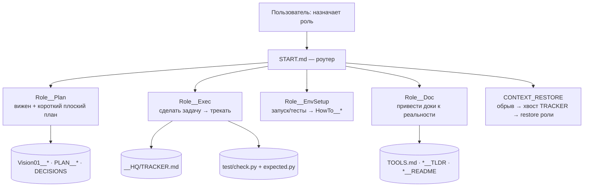

# WORKFLOW — как устроена работа в этом репо (облегчённый ProjectStarter)

> **Что это:** цельное пояснение рабочей СХЕМЫ этого репозитория — какие роли, как идёт поток. Это
> не product-vision конкретного тула (те — в `Vision01__<tool>.md`), а описание метода. Истина по
> деталям — файлы скелета (`START.md`, `__HQ/Role__*`, `__HQ/guides/`); здесь — картина целиком.

## Чем этот репо отличается от полного ProjectStarter

`tools/` — маленькая мастерская «рук» (CLI-утилит). Полный скелет ProjectStarter несёт ещё два
тяжёлых слоя, которые здесь **сняты сознательно**:

- **нет карточек (`__map/`)** — репо маленький; «карта» тут = сами доки тулов (`TOOLS.md`,
  `Vision01__*`, `*__TLDR`, `*__README`) плюс сами тулы (`get_codeblock --outline`, `import_search`);
- **нет длинного план-ритуала** (нет дерева `plans/`, нет разбивки Plan→Task→Context) — планируем
  легко: вижен + короткий плоский `PLAN__<slug>.md`, состояние — в `TRACKER`.

Что осталось от скелета: роутинг по ролям (`START.md`), трекер-хвост, реестр решений (`DECISIONS`),
само-адресующиеся имена, восстановление после обрыва.

## Роли

## Поток работы

1. **Планирование (лёгкое)** — `Role__Plan`: поправить вижен тула / написать короткий плоский план.
   Без grade-aware нарезки на таски.
2. **Исполнение** — `Role__Exec`: взять задачу (хвост `TRACKER` / юзер) → сделать → держать
   `test/check.py` зелёным → лог в хвост трекера.
3. **Окружение** — `Role__EnvSetup`: как запускать/тестировать → `HowTo__Run/Test`.
4. **Документирование** — `Role__Doc`: доделали фичу/флаг → привести доки тула (`TLDR`/`README`/
   `Vision` + строка в `TOOLS.md`) к реальности.
5. **Восстановление** — обрыв → `CONTEXT_RESTORE` → хвост `TRACKER` + restore-секция роли.

## Ключевые механизмы

- **Само-адресующиеся имена:** `<Tag><N>[-<Tag><N>]__<slug>.md`. Имя = грепаемый адрес.
- **Трекер = хвост-лог:** читать только хвост; ротация `TRACKER2/3`.
- **Регистр решённого:** `__HQ/DECISIONS.md` — закрытые решения + однострочное «почему»; читать
  перед проектированием, не релитигировать.
- **Golden-тесты:** оракул = ручной подсчёт человеком; через каждое изменение — `py test/check.py`.

## Принцип

**Разгрузка, не наполнение.** Инструмент должен давать агенту ровно нужный контекст без шума —
это и есть рычаг для слабых/локальных моделей. Тулы — маленькие, универсальные, компонуются пайпами
(Unix-философия), а не растут в монстра.
