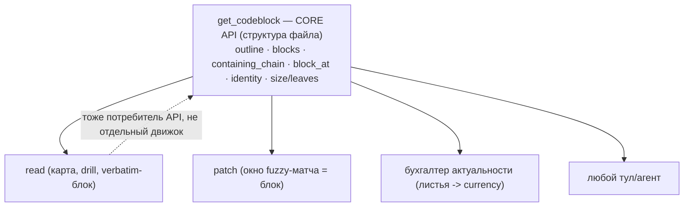

# get_codeblock → Vision 04: провайдер структурного ядра + защита масштаба

**Дата:** 2026-08-20. **Статус:** идеология зафиксирована, не реализовано.
Продолжение линии: Vision02 обобщил ось **ЯЗЫКОВ** (один движок), Vision03 — ось **BACKEND'ов**
(универсальный ридер: код/md/docx/…). Vision04 обобщает ось **ПОТРЕБИТЕЛЕЙ**: кому и как get_codeblock
раздаёт понимание структуры файла.

Родственный документ (продуктовая сторона, репо hermes-filetools): `__HQ/vision/BRAINSTORM__read_patch.md`
— там read/patch/бухгалтер поверх этого ядра. Здесь — взгляд самого тула: **чем он становится**.

## Ключевая цель — куда ведём и зачем

get_codeblock перестаёт быть «конечным CLI-тулом, который читает человек/агент». Он становится
**провайдером структурного ядра**: единственным источником правды о том, «как устроен этот файл» —
дерево блоков, их идентичность, границы, размеры, цепочка контейнеров строки, карта (outline).

Зачем: несколько потребителей уже хотят ОДНО И ТО ЖЕ понимание структуры —
- `read` — карту файла (широкий угол вместо стены);
- `patch` — блок, содержащий строку N, как **окно для fuzzy-матча** (line-hint + локальный поиск);
- **бухгалтер актуальности** — листья (мелкие блоки) как единицы currency (правка одного не рушит
  соседей), с устойчивой идентичностью, переживающей сдвиг номеров;
- любой будущий тул/агент — «дай карту / границы / блок по строке».

Если каждый реализует своё понимание структуры — **рассинхрон**. Мы это уже видели вживую: адресация
и карты разъехались на два движка (старые хендлеры vs reader), и один и тот же вопрос «какой блок на
строке N» давал два разных ответа + баг лесенки на большом файле. **Провайдер = один структурный
контракт, все потребители консистентны по определению.**

## Две развилки судьбы — и почему это НЕ «или-или»

1. **Встроить** — get_codeblock складывается внутрь `read` как «умный режим» (для больших файлов read
   по умолчанию отдаёт карту, а не текст).
2. **Провайдер core-API** — get_codeblock выставляет наружу стабильный API, которым питаются read,
   patch, бухгалтер, и кто угодно.

**Решение: провайдер как ФУНДАМЕНТ, встраивание — как ОДИН из потребителей.** `read` встраивает
get_codeblock *через его же API*. Тогда «встроено в read» и «раздаёт всем» — не конфликт, а один
механизм: один структурный движок кормит всех, включая read.



## Поверхность CORE API (что раздаёт)

Стабильный контракт (детали — по мере реализации; уже частично есть в `reader/`):
- `outline(path, {focus_line, focus_level, size_adaptive}) → rows` — карта (адаптивная глубина; фокус
  на блок как «отдельный файл»). Уже реализовано в `reader/`.
- `containing_chain(path, line) → [block…]` — цепочка контейнеров, с УЧЁТОМ преамбулы (тычок в
  doc-коммент → его блок). Уже есть: `reader/classify._containing_chain` + `_owning_block`.
- `block_at(path, line) → block{range, identity, size, kind}` — блок по строке (окно для patch).
- `block_identity(block) → key` — устойчивый строковый ключ (name-path, напр. `Class.method`),
  переживающий сдвиг номеров → ключ currency у бухгалтера.
- `leaves(path) → [unit…]` — мелкие блоки + filler-полосы как единицы актуальности (Vision: currency
  по МЕСТУ, не по файлу).
- размеры/пороги — для адаптивных решений «карта vs текст».
- (Vision03) backend-реестр — не-код источники (docx/pdf/…): тот же API, другой backend.

**Инвариант провайдера:** get_codeblock раздаёт **структуру, не политику**. Он НЕ решает «показать
карту или текст», «принять правку или нет» — это решают потребители (read/patch). Ядро только знает,
как устроен файл. Это держит его переиспользуемым.

## Защита масштаба (монстро-файлы) — и вопрос про `--force`

**Проблема:** стеной может стать НЕ только текст. Три источника стены, и защита нужна на ВСЕХ трёх:
1. **текст файла целиком** (обычный `read` большого файла);
2. **текст блока** (`query` монстро-класса на 14000 строк);
3. **САМА КАРТА** (`outline`) — файл на 800 top-level функций даёт карту на 800 строк. Карта тоже
   стена, просто из labels вместо кода. Адаптивная глубина (shown 1..2) это НЕ спасает — она режет
   вглубь, а стена тут вширь.

**Дизайн — защита это ПОВЕДЕНИЕ ПО УМОЛЧАНИЮ, а не флаг:**
- **текст (файл/блок):** сверх порога строк/байт → отдаём **карту/под-карту**, не стену. `read файла`
  и `query блока` — одна размер-адаптивная операция на разных масштабах.
- **карта (outline):** сверх бюджета СТРОК КАРТЫ → не вываливаем все 800. Варианты (открыто, выбрать):
  режем до бюджета + «ещё N — options для пагинации/фильтра»; ИЛИ группируем по регионам/секциям
  (если есть); ИЛИ отдаём «мета-карту» (счётчики по видам: «800 функций, 12 классов — вот первые 40 +
  как отфильтровать»). Смысл: карта тоже адаптивна по РАЗМЕРУ, не только по глубине.
- Никакого «включи защиту» флага — она всегда включена, на всех трёх.

**Люк «дай всё равно целиком» — ОДИН, и как МОДИФИКАТОР действия, не отдельный флаг:**
- «много флагов плохо» (OMP-урок: локальная модель тонет в флагах — подтверждено тестом). Поэтому НЕ
  заводим `--force` отдельным JSON-флагом схемы.
- Люк — **модификатор существующего действия**: `--query force` / `read path force` (или через
  free-text `options: force|raw`). Одна идея «дай сырое/полное», приклеенная к тому действию, которое
  уже вызываешь, а не новый флаг верхнего уровня.
- **Главное: тул сам подсказывает люк В ВЫВОДЕ, когда упёрся в порог.** Модель не обязана знать модиф
  заранее — узнаёт ровно тогда, когда он нужен:
  ```
  //блок 14000 строк — показана карта членов.
  //  query <под-блок>   -> нужный кусок
  //  query <этот> force  -> вывалить целиком (стена, дорого)
  ```
- То есть не «добавить флаг `--force`», а **защита-по-умолчанию (текст И карта) + один люк-модификатор
  + подсказка-в-выводе**. Это снимает тревогу «много флагов». (Плюс overflow → артефакт: полный текст
  доступен по явному id, не грузит контекст.)

**Порог** (черновик, как у OMP): файл/блок ≤ ~2 MiB и ≤ ~20k строк — можно и текстом; больше — карта;
мелкое (< ~100 строк) — сразу текстом. Точные числа — открыто.

## Предпосылка: миграция адресации на reader

Провайдерская роль требует **одного** структурного движка. Сейчас адресация (`get_blocks`/`line_level`)
живёт в СТАРЫХ хендлерах, а карты — в `reader`. Пока их два — «провайдер» раздаёт два разных ответа
(и уже ловил баг лесенки). Значит **миграция адресации на reader** (см. `CONTEXT_RESTORE_TOOLS.md` →
«⭐ МИГРАЦИЯ адресации») — прямая предпосылка Vision04: сначала одно ядро, потом оно провайдер.

## Интерфейс: команда = предложение (полностью — в Vision03)

Грамматика вызова («флаги складываются в предложение»: адрес → глагол → наречия; канонический порядок;
`--level`/`--ancestor-level` раздельно; GBNF запирает форму) — в **`Vision03` → «Грамматика вызова»**.
Здесь только следствие для **защиты масштаба**: `--force`/`raw` — **замыкающее НАРЕЧИЕ** предложения, не
отдельный top-level флаг. Невидимо, пока не нужно; тул подсказывает его в выводе в момент упора в порог.
Это снимает ложную дилемму «force как модификатор vs как флаг» — он и есть последнее слово фразы.

## Инварианты Vision04 (в дополнение к 01–03)

- **Один структурный контракт → все потребители консистентны.** Никаких параллельных реализаций
  «какой блок на строке N».
- **Ядро раздаёт структуру, не политику.** read/patch/бухгалтер накладывают политику сверху.
- **Защита масштаба — дефолт, не флаг.** Стена бывает трояка: текст файла, текст блока, И сама карта
  (широкий outline). Все три режутся по умолчанию. Люк один — **модификатор действия** (`… force`),
  не новый флаг, с подсказкой-в-выводе.
- **Встраивание в read = через API**, не форк логики. read — потребитель ядра, не его копия.

## Не переписываем — надстраиваем

Всё ядро уже есть в `reader/` (Vision03). Vision04 не рвёт: он (а) фиксирует роль ПРОВАЙДЕРА как цель,
(б) требует миграцию адресации как предпосылку (одно ядро), (в) задаёт защиту масштаба как поведение
по умолчанию + один люк. CLI (`--outline`/`--dot`/`--line`/`--query`) остаётся — это просто один из
потребителей API, тонкая обёртка над тем же ядром.
