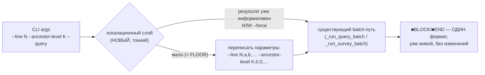

# get_codeblock → Vision 05: защита масштаба СНИЗУ (эскалация малоинформативного вывода)

**Дата:** 2026-09-13. **Статус:** реализовано 2026-09-13 (`get_codeblock/escalate.py`, `--force`,
`CONFIG__TOOLS.ESCALATE_*`). Ladder-хинт соседей (`--line` без `--query`) — отдельным пунктом,
всё ещё не сделан.
Продолжение `Vision04__get_codeblock.md`. Vision04 закрыл защиту от СТЕНЫ (файл/блок/карта слишком
большие → режем вниз, до карты). Vision05 — **зеркальное направление**: результат слишком МАЛЕНЬКИЙ/
неинформативный (пустой сигнал) → расширяем вверх/вширь. Тот же принцип «защита — поведение по
умолчанию, не флаг», тот же люк-модификатор (`--force`, уже зарезервирован Vision03/CONTRACT.md как
последнее слово канонического предложения) — только приложенный к противоположному краю масштаба.

## Источник — живой фидбек, не гипотеза

`__dev/Requests/claude_feedback__gcb.md` (2026-09-04), два связанных пункта:
- flat const-файл (top-level `export const X = {...}` без вложенности) → `--line 1 --ancestor-level 0
  --query` вернул только 2-строчный `import`-блок — технически верно, практически пусто.
- Общий паттерн: короткий/плоский файл, `--query` на дефолтном уровне даёт слишком мало, чтобы агент
  мог работать без запасного `Read`.

## Ключевая идея — эскалация ПАРАМЕТРОВ, не результата

Эскалация — отдельный **эвристический слой НАД вызовом**, который подменяет входные параметры
(`--line`/`--level`/`--ancestor-level`) ДО того, как они уйдут в уже существующий, оттестированный
путь резолва/рендера. Она не трогает сам движок и не добавляет новый рендер:



**Важная граница (по аналогии с Vision04 «ядро раздаёт структуру, не политику»):** импортируемый
`get_codeblock()` (Python API, README «Importable API») эскалацию НЕ видит вообще — она живёт только
в CLI/dispatch-слое `core.py`. Это то же самое, что означает `--force` изнутри: API уже сегодня ведёт
себя как «форсированный» вызов (точные параметры → точный единственный блок), так что новый CLI-флаг
не меняет контракт API, только достраивает CLI поверх него.


## Модуль и точка подключения

Эскалация — **отдельный файл**, `get_codeblock/escalate.py` (тот же паттерн, что `profiles/<lang>.py`
для языков — Vision03: новая возможность = свой файл-плагин, ядро не трогаем). Один вход, чистая
функция без побочных эффектов:

```python
def maybe_escalate(file_path, lines, line_nums, levels, query) -> (new_line_nums, new_levels, note)
```

Если результат уже информативен (или передан `--force`) — возвращает исходные массивы без изменений,
`note=None`. Если сработала — возвращает расширенные `line_nums`/`levels` + строку-объяснение.

**Точка подключения в `core.py`** — сразу ПЕРЕД диспетчеризацией в `_run_query_batch`/
`_run_survey_batch` (там, где уже готовы `line_nums`/`levels` после broadcast-разбора аргументов):
один вызов `maybe_escalate(...)`, дальше существующий batch-путь получает уже (возможно)
расширенные параметры и ничего не знает о том, что они менялись — рендер не тронут вообще.

**Печать при срабатывании — строка ВСЕГДА, не TTY-only.** В отличие от существующих зелёных
человеческих подсказок (`emit_legend`, outline-хинты — `is_tty`-gated, только для интерактивного
терминала), сообщение об изменении параметров — это **факт о том, что реально было запрошено у
движка**, а не совет. Печатается тем же `c()`-комментарием, что и остальные метаданные (`#File:`,
header outline), безусловно:

```
#параметры изменены: --line 12 → --line 4,8,12,19,28 (плоский вывод неинформативен) · используй --force для точного вывода без эскалации
```

Причина безусловности — см. следующий раздел (эмпирическая проверка TTY-режима реальных клиентов).

## TTY-режим реальных клиентов — проверено эмпирически

Была гипотеза (моя, неверная): «пусть параметр-нота печатается всегда, потому что программные
потребители обычно НЕ в TTY» — и встречная гипотеза (пользователя): «наши клиенты (Claude-агенты,
другие агенты) в основном ИМЕННО в TTY-режиме, т.к. это простой скрипт-файл, вызываемый из
инструмента-оболочки». Проверил обе прямо в этой среде:

```python
python -c "import sys; print(sys.stdout.isatty())"   # → False
```

и вживую — реальный вызов `get_codeblock.py --outline` через Bash-инструмент этой сессии печатает
ТОЛЬКО `#`-строки, ни одной зелёной TTY-подсказки (`emit_legend` и т.п.) не появляется. То есть **в
этом конкретном харнессе агент уже сегодня не видит существующие TTY-only подсказки** — гипотеза
пользователя не подтвердилась ЗДЕСЬ (`isatty() == False` при вызове через Bash-инструмент), хотя
не исключено, что другой харнесс (другой терминальный интерфейс агента, pty-обёртка) даёт другой
результат — это не проверялось и, по всей видимости, зависит от конкретной оболочки-хоста агента.

**Практический вывод не меняется, а только усиливается**: раз ЕСТЬ хотя бы один реальный харнесс
(этот), где TTY-only подсказки агенту не долетают вообще, сообщение об изменении параметров ОБЯЗАНО
быть безусловной metadata-строкой (`#параметры изменены: …`), не TTY-gated хинтом — иначе именно та
аудитория, для которой это критично (агент, получивший текст НЕ того диапазона, что просил), рискует
её не увидеть. Третий канал — импорт `get_codeblock()` напрямую как Python-функции («вклеить вывод
куда-то программно») — вообще не печатает ничего, идёт мимо `stdout`; там эскалации по дизайну нет
(см. «Важная граница» выше), так что TTY-вопрос к этому каналу неприменим.

## Два режима, разное поведение

### `--line` БЕЗ `--query` (лесенка) — ОТЛОЖЕНО на отдельный заход, вне скоупа этой реализации

Никакой подмены параметров — идея (безусловная информационная строка с именами соседних именованных
символов на уровне попадания, не полный outline) не подпадает под «эскалация ТОЛЬКО параметров
вызова» (лесенка ничего не резолвит заново, значит это не эскалация в смысле этого Vision). Делаем
её **позже, отдельным пунктом**, когда дойдём: безусловно (не флаг, не `--force`-зависимо — всегда
видно), но отдельно от `--query`-эскалации, реализованной в этом заходе первой.

### `--query` — эскалация параметров, ГОРИЗОНТАЛЬНАЯ по умолчанию

**Ловушка, которую нужно обходить:** вертикальный подъём (`--ancestor-level +1`) может быть
непропорционально большим скачком — маленький блок внутри метода-монстра эскалирует сразу в тысячи
строк. Поэтому:

- **Основной режим — горизонтальный**: добираем СОСЕДНИЕ блоки на ТОМ ЖЕ уровне (чередуя вверх/вниз
  от исходного якоря), не поднимаемся по дереву.
- **Вертикальный подъём — только fallback**, когда соседей вообще нет (блок единственный на своём
  уровне — например единственный top-level класс в файле).
- Технически горизонтальная эскалация — это просто **другой набор входных параметров** для уже
  существующего batch-пути: `--line`/`--level`/`--ancestor-level` уже принимают массивы и уже умеют
  разный уровень на разный якорь (`CONTRACT.md` → «Batch-координаты», broadcast-правило). Эскалация
  ничего не добавляет в `_run_query_batch` — она просто ГЕНЕРИРУЕТ более длинный вход для него.
- **Применяется и к ЯВНОМУ `--ancestor-level`/`--level`, не только к дефолту.** Явный `--ancestor-level
  2 --query`, если результат всё равно мал, тоже эскалирует — добавлением соседних якорей со своим
  уровнем (`--line 10,15 --ancestor-level 2,0`), а не игнорированием явного запроса.
- **Применяется и ВНУТРИ уже явного batch-вызова** (`--line a,b,c --query`, каждый со своим
  `--level`/`--ancestor-level`). Механика: сначала резолвим КАЖДЫЙ якорь до его АБСОЛЮТНОГО уровня
  в файле обычным путём (broadcast + `--ancestor-level`/`--level`, как сегодня) — получаем список
  реальных глубин, например `{3, 3, 2}`. **Референс-уровень = MAX среди них** (самый глубокий/
  вложенный) — в примере `3`. Все уже резолвленные диапазоны становятся ИСХОДНЫМИ («затравочными»)
  якорями, а дальше горизонтальная эскалация добирает ЕЩЁ соседей НА ЭТОМ референс-уровне (левее и
  правее по файлу), тем же критерием `cost()`/`CEILING`, что и для одиночного якоря — одиночный
  случай (n=1) просто вырожденный частный случай этого правила (референс-уровень = уровень
  единственного якоря).

## Критерий отбора — асимметричный квадратичный штраф

```
cost(n) = (n - TARGET)² × (1, если n ≥ TARGET, иначе K)      K > 1 (черновик: 1.5–2)
```

- **FLOOR** (черновик: 12 непустых строк) — ниже него результат считается малоинформативным,
  эскалация запускается.
- **CEILING** (черновик: 40 строк — переиспользуем существующую `OUTLINE_MAX_ROWS` из
  outline-адаптивности `core.py`, для консистентности одного и того же «сколько это уже много»
  между outline и query).
- **TARGET** — желаемая точка (черновик: середина FLOOR..CEILING, ~16-20 строк, число открыто).
- Алгоритм: добавляем соседей по одному, считаем `cost` на каждом шаге; останавливаемся и берём
  **последний вариант ДО** того, как сумма впервые пробьёт CEILING — не «ближайший к TARGET
  вообще», а «лучший `cost` среди вариантов, не пробивших потолок». Асимметрия `K` реализует
  «недобрать чуть-чуть хуже, чем перебрать чуть-чуть» при близких по модулю отклонениях; сам квадрат
  уже гарантирует, что большой перебор (за CEILING) никогда не победит маленький недобор.

**Дефолты зафиксированы:** `FLOOR=12`, `CEILING=40` (= `OUTLINE_MAX_ROWS`), `TARGET=18`, `K=1.5`.

**Константы живут в `CONFIG__TOOLS.py`** (`ESCALATE_FLOOR`/`ESCALATE_TARGET`/`ESCALATE_CEILING`/
`ESCALATE_K`), тот же паттерн, что уже есть у `core.load_config()` (`try: from CONFIG__TOOLS import
...; except ImportError: используем хардкод-дефолты`) — `escalate.py` читает их сам, не через
`core.load_config()` (тот сегодня знает только про `PROJECT_ROOT`, чужой список ключей туда не
дописываем — у `escalate.py` свой независимый, самодостаточный импорт, тот же принцип, что у
per-language профилей).

**Проверено на живой фикстуре** (`__dev/Requests/feedback/files/.../electricalCapacityOptions.ts` —
тот самый flat const-файл из фидбека Клода):
- `--line 1 --query` (2-строчный import-блок, `FLOOR`=12 не пройден) → эскалация добирает
  следующего соседа `[4-26]` (23 строки, `ampsOptions`) → итог 25 строк, `cost=(25-18)²=49`.
  Без эскалации `cost=(2-18)²×1.5=384` — решение однозначно лучше.
  Второй сосед `[28-45]` (18 строк, `voltsOptions`) НЕ добирается: 25+18=43 > `CEILING`(40) —
  останавливаемся на 25. Дефолты ведут себя разумно на реальном кейсе, менять не нужно.
- **Побочная находка (не блокирует Vision05, отдельный баг/квирк для будущего разбора):** `--query`
  на line 54 (`export const ampsLabels = lodash.invert(ampsOptions);` — простой assign, не
  object/array-литерал) резолвится в `[4-60]` — «эатягивает» назад ВСЕ предыдущие top-level
  консты, включая уже-самостоятельно-адресуемые object-литералы (`ampsOptions`/`voltsOptions`/
  `phaseOptions`), хотя каждый из них по отдельности резолвится корректно ({`[4-26]`/`[28-45]`/…).
  Похоже, что filler-container-фолбек (`address.py`/`classify.filler_container_at`) не останавливает
  обратное расширение на границе чужого standalone-тела, когда сам таргет — простой statement без
  тела. Не трогаем сейчас — вне скоупа эскалации, но стоит завести отдельный REQ/баг-репорт позже.

Точные числа выше — рабочие дефолты, не «открыто» больше; корректируются по практике использования.

## `--force` — обычный CLI-флаг, не JSON-контракт инструмента

Уже зарезервирован (Vision03 «Грамматика вызова», CONTRACT.md строка 540) как **последнее наречие**
канонического предложения: `--project-root → --file → --line → --level/--ancestor-level →
--outline/--query/--dot → --numbered → --force`. Подтверждено CONTRACT.md («капы размера/`--force`
... механики пока нет, отдельный заход») — сознательно отложен, не забыт. Семантика (установившийся
паттерн этого тулкита — см. `make_interface_card.py --force`, с поправкой на масштаб): «тул по
умолчанию делает что-то защитное (тут: эскалирует малоинформативный результат) — `--force` явно
приказывает не делать этого, отдать ровно то, что запрошено буквально».

- **Одна строка в общем `--help`** (не развёрнутое многоабзацное описание) — обычная CLI-опция,
  не отдельный флаг схемы function-calling. Финальная формулировка:
  ```
  --force   гарантирует вывод именно запрошенного диапазона, игнорируя длины контекста —
            как малую (Vision05, эскалация вверх), так и большую (Vision04, урезание вниз до карты)
  ```
  Это ОДИН и тот же флаг для обеих защит масштаба (Vision04 «стена» + Vision05 «пустота») — не два
  разных `--force`, юнифицированная семантика «дай буквально то, что я попросила, без опеки тула».
- **Тул сам подсказывает его контекстно** в момент срабатывания эскалации (по аналогии с Vision04:
  «показана карта — используй `force` для полного текста»), а не только через статичный `--help`.
- Отключает **весь** эвристический слой Vision05 разом: и горизонтальную/вертикальную эскалацию
  `--query`, и информационную строку соседей у `--line` без `--query` (единая семантика: «без лишних
  мнений тула»).
- **НЕ покрывает** адаптивность `--outline` (Vision04, отдельный, более старый механизм со своим
  люком — `--level N` для точного предела глубины). Разные защиты, разные люки; `--force` в Vision05
  — только про малый-результат-эскалацию.

## Тестирование — без ручного golden-ревью на каждый кейс

Поскольку эскалация — подмена параметров перед уже оттестированным рендером, не нужен построчный
ручной обзор новых golden-фикстур. Единственная нужная проверка на кейс: ручной вызов с ТЕМИ ЖЕ
параметрами, что выдала эскалация (`--line 3,12,18 --ancestor-level ...`), должен байт-в-байт
совпасть с автоэскалированным выводом. Один раз сверили эквивалентность — дальше можно свободно
записывать golden из живого вывода тула.

## Побочный долг (не блокирует Vision05, отдельный заход)

`get_codeblock__README.md` → «Output Format» → «Text mode (with `--query`)» показывает СТАРЫЙ формат
(`#Block level: 3 range: 71-77` / `#Block end: 77`), которого в живом коде уже нет — везде
`■BLOCK`/`■END`. Доку нужно поправить, но это независимо от эскалации — переживший рефакторинг
формата хвост документации, найден попутно при аудите перед этим Vision.

## Открытые развилки — ЗАКРЫТЫ, готово к реализации

1. ~~Точные числа FLOOR/TARGET/CEILING/K~~ → `12`/`18`/`40`/`1.5`, проверены на живой фикстуре.
2. ~~Эскалирует ли слой внутри явного batch~~ → да, через референс-уровень = MAX резолвленных
   абсолютных уровней среди якорей.
3. ~~Формулировка `--help`~~ → готова (см. раздел `--force` выше).

Единственное реально отложенное — ladder-хинт соседей у `--line` без `--query` (свой пункт выше,
не блокирует эту реализацию).

## Инварианты Vision05 (в дополнение к 01-04)

- **Защита масштаба — дефолт, в обе стороны.** Vision04 режет стену вниз; Vision05 расширяет пустоту
  вверх/вширь. Один и тот же люк-паттерн (`--force`, реактивная подсказка), приложенный к
  противоположным краям.
- **Эскалация — подмена параметров, не новый рендер.** Существующий batch-путь (`_run_query_batch`)
  переиспользуется без изменений; новый код — только эвристика ВЫБОРА параметров.
- **`get_codeblock()` (импортируемый API) эскалацию не видит.** Ядро раздаёт структуру по буквальному
  запросу; политика «расширить, если мало» — только в CLI-слое `core.py`, ровно как в Vision04
  («ядро раздаёт структуру, не политику»).
- **Горизонтальная эскалация — приоритет над вертикальной**, чтобы не проваливаться в
  непропорциональный скачок объёма при подъёме на уровень внутри большого родителя.
