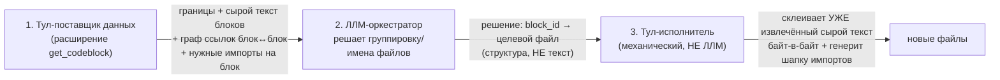

# Vision 06: разборщик монструозных файлов (семя идеи, строится НА get_codeblock)

**Дата:** 2026-09-13. **Статус:** брейншторм — идеология НЕ зафиксирована, только семена и открытые
вопросы. Не путать с Vision04/05 (те уже решения; здесь — черновик направления).

## Ключевая идея

get_codeblock уже умеет находить границы блоков и резолвить их текст. Следующий шаг — не просто
ЧИТАТЬ монструозный файл по кускам, а **разобрать его на несколько файлов**, программно, с минимумом
риска потерять/исказить текст.

## Три роли (не две — это ключевое уточнение живого обсуждения)

- **Тул-поставщик** — факты, не решения (тот же принцип, что везде в get_codeblock — Vision04
  «ядро раздаёт структуру, не политику»). Даёт: границы top-level блоков (уже есть — `--outline`),
  сырой текст без метаданных (**новый флаг, обсуждался — `--raw` на `--query`**, дёшево), граф
  ссылок между блоками ОДНОГО файла, нужные внешние импорты на блок.
- **ЛЛМ-оркестратор** — управляет процессом, СМОТРИТ на данные и РЕШАЕТ группировку/имена. Текст
  руками не трогает вообще — только структурное решение (`block_id → целевой файл`).
- **Тул-исполнитель** — механически, детерминированно склеивает уже вырезанный текст в новые файлы
  + генерит шапку импортов. Ответственный шаг «не потерять/не исказить текст» — целиком здесь, НЕ
  в руках модели.

**Почему так, а не «ЛЛМ сама пишет куски»:** ретайпинг/копирование текста моделью на разборке
большого файла — риск потери/искажения контента. Держим это единственным местом, где всё строго
байт-в-байт из уже извлечённого тулом текста.

## Что уже есть (переиспользуем, не изобретаем)

- **Границы + сырой текст блока** — `get_codeblock --outline`/`--query`, нужен только новый флаг
  `--raw` (печать резолвленного блока без `#File:`/`■BLOCK`/`■END` — урезанный рендер, не новая
  логика резолва).
- **Кто на что ссылается МЕЖДУ файлами** — `find_code_usage` уже это делает (`consumers`/`incoming`
  анализ для символа), но это МЕЖФАЙЛОВЫЙ трейс, не то, что нужно здесь напрямую.

## Единственный реально новый кусок

**Граф ссылок блок↔блок ВНУТРИ ОДНОГО файла** — какие top-level блоки используют имена/символы
других top-level блоков ТОГО ЖЕ файла. Это НЕ то же самое, что `find_code_usage` (тот — между
файлами) — нужен отдельный, более узкий анализ: по каждому top-level блоку, какие идентификаторы он
использует, и резолвятся ли они на имя другого top-level блока в этом же файле. Плюс: какие ВНЕШНИЕ
(файловые) импорты реально нужны каждому блоку — подмножество top-level импортов файла, актуально
используемое именно в этом блоке (нужно для генерации шапки импортов новых файлов).

## Открытые вопросы (ничего не решено, только зафиксированы)

1. **Гранулярность разбиения** — по функции? по классу? по кластеру в графе ссылок (сильно связанные
   блоки — в один файл)? Кто это решает: тул подсказывает кластеры, ЛЛМ утверждает/переопределяет?
2. **Восстановление импортов между новыми файлами** — самое рискованное место: циклические импорты
   между свежесозданными кусками, Python-пакеты (`__init__.py`/относительные импорты), TS
   barrel-реэкспорты, порядок side-effects при импорте (декораторы, регистрация). Не решено, как
   тул-исполнитель это разруливает механически — вероятно нужен ещё один проход валидации
   (синтаксис/циклы), не только генерация.
3. **Формат данных для ЛЛМ** — что именно тул-поставщик отдаёт (JSON? тот же `.0`-подобный формат,
   что уже используют другие режимы get_codeblock?). Не решено.
4. **Формат решения ЛЛМ → исполнитель** — структура `block_id → целевой файл` устраивает как
   концепция, точный контракт не определён.
5. **Что происходит с общими (module-level) константами/типами, используемыми несколькими будущими
   кусками** — отдельный "shared"-файл? Как его называть/куда класть? Не решено.
6. **Ревью-цикл** — предполагается, что ЛЛМ/человек проверяет предложенное разбиение до принятия
   (не блайнд-автомат — тот же принцип, что и в остальном тулките), но сам процесс ревью не
   спроектирован.

## Не инварианты — просто пока фиксируемые ограничения

- Тул-исполнитель никогда не порождает/не меняет текст блока — только копирует байт-в-байт то, что
  уже извлёк тул-поставщик.
- ЛЛМ никогда не пишет содержимое файлов на этапе разборки — только структурное решение о
  группировке.
