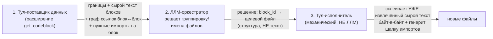

# Vision 06: разборщик монструозных файлов (семя идеи, строится НА get_codeblock)

**Дата:** 2026-09-13. **Статус:** брейншторм — идеология НЕ зафиксирована, только семена и открытые
вопросы. Не путать с Vision04/05 (те уже решения; здесь — черновик направления).

## Ключевая идея

get_codeblock уже умеет находить границы блоков и резолвить их текст. Следующий шаг — не просто
ЧИТАТЬ монструозный файл по кускам, а **разобрать его на несколько файлов**, программно, с минимумом
риска потерять/исказить текст.

## Три роли (не две — это ключевое уточнение живого обсуждения)



- **Тул-поставщик** — факты, не решения (тот же принцип, что везде в get_codeblock — Vision04
  «ядро раздаёт структуру, не политику»). Даёт: границы top-level блоков (уже есть — `--outline`),
  сырой текст без метаданных (**новый флаг, обсуждался — `--raw` на `--query`**, дёшево), граф
  ссылок между блоками ОДНОГО файла, нужные внешние импорты на блок.
- **ЛЛМ-оркестратор** — управляет процессом, СМОТРИТ на данные и РЕШАЕТ группировку/имена. Текст
  руками не трогает вообще — только структурное решение (`block_id → целевой файл`).
- **Тул-исполнитель** — механически, детерминированно склеивает уже вырезанный текст в новые файлы
  + генерит шапку импортов. Ответственный шаг «не потерять/не исказить текст» — целиком здесь, НЕ
  в руках модели.

**Почему так, а не «ЛЛМ сама пишет куски»:** ретайпинг/копирование текста моделью на разборке
большого файла — риск потери/искажения контента. Держим это единственным местом, где всё строго
байт-в-байт из уже извлечённого тулом текста.

## Что уже есть (переиспользуем, не изобретаем)

- **Границы + сырой текст блока** — `get_codeblock --outline`/`--query`, нужен только новый флаг
  `--raw` (печать резолвленного блока без `#File:`/`■BLOCK`/`■END` — урезанный рендер, не новая
  логика резолва).
- **Кто на что ссылается МЕЖДУ файлами** — `find_code_usage` уже это делает (`consumers`/`incoming`
  анализ для символа), но это МЕЖФАЙЛОВЫЙ трейс, не то, что нужно здесь напрямую.

## Единственный реально новый кусок

**Граф ссылок блок↔блок ВНУТРИ ОДНОГО файла** — какие top-level блоки используют имена/символы
других top-level блоков ТОГО ЖЕ файла. Это НЕ то же самое, что `find_code_usage` (тот — между
файлами) — нужен отдельный, более узкий анализ: по каждому top-level блоку, какие идентификаторы он
использует, и резолвятся ли они на имя другого top-level блока в этом же файле. Плюс: какие ВНЕШНИЕ
(файловые) импорты реально нужны каждому блоку — подмножество top-level импортов файла, актуально
используемое именно в этом блоке (нужно для генерации шапки импортов новых файлов).

## Открытые вопросы (ничего не решено, только зафиксированы)

1. **Гранулярность разбиения** — по функции? по классу? по кластеру в графе ссылок (сильно связанные
   блоки — в один файл)? Кто это решает: тул подсказывает кластеры, ЛЛМ утверждает/переопределяет?
2. **Восстановление импортов между новыми файлами** — самое рискованное место: циклические импорты
   между свежесозданными кусками, Python-пакеты (`__init__.py`/относительные импорты), TS
   barrel-реэкспорты, порядок side-effects при импорте (декораторы, регистрация). Не решено, как
   тул-исполнитель это разруливает механически — вероятно нужен ещё один проход валидации
   (синтаксис/циклы), не только генерация.
3. **Формат данных для ЛЛМ** — что именно тул-поставщик отдаёт (JSON? тот же `.0`-подобный формат,
   что уже используют другие режимы get_codeblock?). Не решено.
4. **Формат решения ЛЛМ → исполнитель** — структура `block_id → целевой файл` устраивает как
   концепция, точный контракт не определён.
5. **Что происходит с общими (module-level) константами/типами, используемыми несколькими будущими
   кусками** — отдельный "shared"-файл? Как его называть/куда класть? Не решено.
6. **Ревью-цикл** — предполагается, что ЛЛМ/человек проверяет предложенное разбиение до принятия
   (не блайнд-автомат — тот же принцип, что и в остальном тулките), но сам процесс ревью не
   спроектирован.

## Не инварианты — просто пока фиксируемые ограничения

- Тул-исполнитель никогда не порождает/не меняет текст блока — только копирует байт-в-байт то, что
  уже извлёк тул-поставщик.
- ЛЛМ никогда не пишет содержимое файлов на этапе разборки — только структурное решение о
  группировке.

## v0 — решено в разговоре 2026-09-15 (прикладная цель: Plan21 на hermes-filetools)

Название: **`split_monster.py`**. НЕ часть `get_codeblock` — отдельный тул-исполнитель, `get_codeblock`
остаётся чистым поставщиком данных, ничего в нём не меняем ради этой задачи.

**`--raw` не нужен.** Открыт был вопрос №3 (формат данных для ЛЛМ) — закрыт частично: если дёргать
`get_codeblock` не через CLI, а через его же **импортируемую функцию**
(`get_codeblock/core.py:352 get_codeblock(file_path, line_num, level=1, query=True) -> {level, start,
end, text}`), `text` уже приходит байт-в-байт БЕЗ анкеров `#File:`/`■BLOCK` — обёртка их добавляет
только CLI-рендер. `level=1` = топовый охватывающий блок (`resolve()`, core.py:308) — для строки внутри
топ-левел объекта это сам объект целиком, никакой эскалации (`--force` там же не нужен — эскалация
существует только в CLI batch/survey-рендере, не в этой функции).

**Граф внутрифайловых ссылок (см. «Единственный реально новый кусок» выше) НЕ нужен на v0 в том виде,
в каком задуман.** Вместо построения общего графа блок↔блок — на v0 группировку (`block_id → целевой
файл`) формулирует ЛЛМ вручную (я уже читаю файл целиком по ходу планирования Plan21 и так знаю, что
куда едет) — автоматический анализ зависимостей остаётся задачей будущей полностью автоматической
версии, не v0.

**Импорты идут через ту же библиотеку, что и перенос — не через ручной `Edit` постфактум.** Первая
версия этого плана (записана 2026-09-15) предполагала, что тул импорты вообще не трогает, а я
дописываю их обычным `Edit` сразу после переноса. Живое обсуждение 2026-09-16 это уточнило: раз всё
равно есть готовый исполняемый интерфейс (см. «Интерфейс» ниже), дешевле провести и импорты через
него же (`add_import(...)`), а не заводить отдельный ручной проход. На v0 тул НЕ пытается сам
УГАДЫВАТЬ, какой импорт нужен (это по-прежнему знание ЛЛМ, не автоматика) — просто способ ЗАПИСАТЬ
это знание теперь единый со способом задать перенос блоков, а не отдельная ручная правка файла.
Автоматическое ПРЕДЛОЖЕНИЕ импортов (на основе графа блок↔блок) — уже v1, см. «Интерфейс».

**Внешние потребители (кто импортирует символ ИЗ файла-монстра) — уже существующая готовая функция,
не новый анализ:** `make_interface_card.py:132 consumers_of(project_root, file) ->
{symbol_name: [(consumer_rel_path, kind, [lines]), ...]}` (на `find_code_usage.scan_downstream`).
Вызывается на `source_file` (файл-монстр) **до** вырезки — она сама парсит декларации из живого
файла, после вырезки символа там для неё уже ничего нет. v0 эти внешние импорты не чинит
автоматически — только печатает список (файл+строка) для ручной точечной правки (их немного, дёшево
по токенам) — это единственное место, где ручная правка вне сгенерированного скрипта всё ещё нужна.

**Обе API-функции (`get_codeblock`, `consumers_of`) — уже готовые, импортируемые напрямую, без
сабпроцессов и временных файлов.** Не городить новый механизм там, где он уже есть как библиотека.

**Механика переноса самих диапазонов (отвечает частично на открытые вопросы №1/№4/№5) — детали см. в
«Интерфейс» ниже, кратко:**
- ВСЕ диапазоны резолвятся `get_codeblock()` по ещё нетронутому файлу, ДО первой мутации
- обрабатываются в порядке УБЫВАНИЯ номера строки (это и так обязательно для безопасного удаления
  из `source_file`, чтобы более ранние номера строк не уезжали)
- в целевой файл каждый новый блок не апендится, а **вставляется в начало** накопленного (в памяти)
  списка тел — раз обход идёт снизу вверх по источнику, а вставка каждый раз в начало цели,
  исходный порядок объектов восстанавливается сам по себе (важно для JS `const`/TDZ, где порядок
  реально имеет значение)
- между ЗАПУСКАМИ тула (если работу пришлось разбить) старым номерам строк не доверяем — на новом
  запуске просто заново читаем текущее состояние файла

## Интерфейс v0/v1 — генерируемый исполняемый Python (решено 2026-09-16)

**JSON и YAML как формат для ЛЛМ-написанной спецификации — отклонены, но не по формальной причине
«не нравится синтаксис».** Настоящая проблема — ВЫХОДНЫЕ токены: если решение (что оставить/убрать,
что поправить) нужно выразить как структурную спеку, я в любом случае либо переписываю данные заново
(классический `Edit` — старый текст + новый текст), либо придумываем отдельный bespoke-протокол
(ID + confirm-флаг — тоже рассматривали, тоже отклонили: он изобретает интерфейс с нуля вместо того,
чтобы использовать уже имеющиеся у меня Read/Edit/Bash). Решение — **тул генерирует не спеку, а
готовый ИСПОЛНЯЕМЫЙ Python-скрипт**, который я читаю, точечно правлю (дёшево — только то, что решаю),
и запускаю. Тот же паттерн, что `git rebase -i`: черновик уже заполнен, правки — точечные, перед
запуском видно ровно что произойдёт.

**`split_monster` — одновременно и CLI, и импортируемая библиотека примитивов**, которые вызывает
сгенерированный (или, на простом v0, написанный мной вручную) скрипт: `cut(range) -> блок`,
`add_import(text) -> импорт`, `monster.write(target_file, blocks, imports)` (запись/дозапись цели),
`monster.cut(source_file, blocks)` (вырезка исходных диапазонов + генерация `source_import`, если
он есть). Вся механика (резолв через `get_codeblock`, порядок снизу вверх, prepend-восстановление
порядка, кэш) живёт ОДИН раз внутри этих примитивов — сам скрипт остаётся тонким.

**Три слоя в скрипте, каждый — отдельные строки, никогда не смешиваются:**
1. **Данные** — диапазоны (`(start, end)`) и сырые строки (текст импорта) как короткие переменные.
2. **Действия** — обёртки над данными (`cut(...)`, `add_import(...)`) в свои переменные.
3. **Сборка** — коллекции действий на каждый `target_file` (`BLOCKS01 = [...]`, `IMPORTS01 = [...]`),
   и в самом низу — вызовы `monster.write(...)`/`monster.cut(...)`, которые фактически исполняют.

**Железное правило форматирования: строка с Python-выражением содержит ТОЛЬКО код и хвостовой тег
`#N` — больше ничего.** Любое описание (что это, откуда, сигнатура из `get_codeblock` — может быть
сколь угодно длинным) — ОТДЕЛЬНОЙ строкой НАД кодом, не на одной строке с ним. Причина: если строка
кода останется короткой и однородной, `Edit` может опираться на неё как на надёжный якорь, а длинное
описание не путается в диапазон правки.

**`#N` — стабильный ID записи, не живой номер строки.** Присваивается один раз при генерации,
дальше не пересчитывается (если выше что-то удалили — тег всё равно остаётся уникальным). Существует
ИСКЛЮЧИТЕЛЬНО как якорь для `Edit` (`old_string` требует уникальности) — тулом программно не
читается, ничего не аргументирует.

**Правка = ДОПИСАТЬ короткую строку снизу, никогда не редактировать существующую.** Комментирование
существующей строки (`# ` + вся строка) требует переписать её целиком — не дешевле обычной правки, и
это была ошибка в первой версии обсуждения. Настоящий приём — Python исполняется сверху вниз, и
дописанное позже присваивание перекрывает более раннее. Убрать элемент из коллекции или отменить
целиком — дописываю СНИЗУ короткую строку с уже существующими короткими именами (`IMPORTS01 = []`
или `BLOCKS01 = [c01]` — оставить только `c01`). Поправить содержимое (тул ошибся в тексте импорта) —
редактирую ИЗОЛИРОВАННУЮ строку данных (`s01 = "..."`), не трогая слои действий/сборки вокруг неё.

### Пример А (первый набросок, тот же принцип, без разделения на слои данных/действий)

```python
BLOCKS01 = [
    # def formatDuration(sec):  [123-145]
    cut(123, 145),  #1
    # def tokensLabel(tokens):  [200-210]
    cut(200, 210),  #2
]

# import { X } from './y.js';  — нужен formatDuration
imp01 = add_import("import { X } from './y.js';")  #3
# import { Y } from './Z.js';  — нужен tokensLabel
imp02 = add_import("import { Y } from './Z.js';")  #4

IMPORTS01 = [
    imp01,  #5
    imp02,  #6
]

monster.write("desktop/src/core-format.js", BLOCKS01, IMPORTS01)
monster.cut("desktop/src/core.js", BLOCKS01)
```

Отменить `imp02` целиком (например tokensLabel едет в другой файл, а не в `core-format.js`) — дописать
снизу, ничего выше не трогая:
```python
IMPORTS01 = [imp01]  #7
```

### Пример Б (полное разделение на слои — данные / действия / сборка)

```python
# def formatDuration(sec):  [123-145]
r01 = (123, 145)                       #1
# def tokensLabel(tokens):  [200-210]
r02 = (200, 210)                       #2
# import { X } from './y.js';  — нужен formatDuration
s01 = "import { X } from './y.js';"    #3

c01 = cut(r01)            #4
c02 = cut(r02)             #5
imp01 = add_import(s01)   #6

BLOCKS01 = [c01, c02]      #7
IMPORTS01 = [imp01]        #8

monster.write("desktop/src/core-format.js", BLOCKS01, IMPORTS01)
monster.cut("desktop/src/core.js", BLOCKS01)
```

Тут же виден и плюс разделения: если тул перепутал текст импорта — правлю только `s01`, ничего в
`c01`/`BLOCKS01`/вызовах внизу не меняется.

**v0 тоже генерирует скрипт — не пишу его целиком руками.** Уточнено 2026-09-16 (продолжение того же
разговора): от меня — только минимальный вход прямо в CLI, без промежуточного файла:
```
split_monster --file desktop/src/core.js --split 123 "desktop/src/core-format.js" --split 456 "desktop/src/core-format.js" --out-script my_move.py
```
(`--split LINE TARGET`, повторяется на каждый move — `nargs=2, action='append'`, не один плоский
список на всех, чтобы не зависеть от чётности количества аргументов). Номера строк — те же, что я и
так вижу в `--outline`, вызывая `get_codeblock` сама. `--out-script` разворачивает эти пары в полный
трёхслойный скрипт (Пример Б формата выше) — сигнатуру/превью каждого блока тул сам подтягивает
через `get_codeblock`, мне для этого ничего печатать не нужно.

**В сгенерированный скрипт тул также вписывает ДЁШЕВУЮ эвристическую подсказку (не настоящий граф) —
затычка для v0, не резолвер.** По каждому диапазону — простой текстовый скан (не через
tree-sitter/семантику): (а) кто ещё в файле упоминает имя этого блока (грep по остальному файлу),
(б) какие идентификаторы из тела блока совпадают с другими топ-левел именами файла (что блоку,
возможно, нужно). Не отличает переменную от одноимённого поля объекта, не резолвит скоуп/шедовинг —
это ПОДСКАЗКА в комментарии, которую я проверяю глазами, не источник истины. Даёт что-то, но
немного — правки руками всё равно нужны (настоящий граф с резолвом — по-прежнему только v1, ниже).
Ценность есть и за пределами момента переноса: сгенерированный скрипт остаётся на диске как читаемый
журнал «что от чего зависело на момент разборки» — ещё одно место, где эта информация не потеряна,
даже когда файл уже давно разъехался по кускам.

**Чем v0 отличается от v1 тогда — не «пишу скрипт руками vs тул генерирует» (генерирует в обеих), а
глубина анализа за генерацией.** В v0 группировку (`line → target_file`) по-прежнему решаю Я — тул
только разворачивает мои пары в полный скрипт + дописывает дешёвые грep-подсказки. В v1 (граф
блок↔блок + `--investigate`, будущая задача, в основном для больших малознакомых файлов вроде
Hermes-гейтвея) тул ещё и сам ПРЕДЛАГАЕТ группировку и по-настоящему резолвит зависимости (тем же
классом инструментов, что `find_code_usage`/`graph_from_cards`, не текстовым грепом). Формат скрипта
и техника правки (дописать снизу) — один и тот же для обеих версий.

**`--investigate` (v1, отдельная сложная задача) должен кэшировать результат на диск, не держать
только в памяти.** На большом файле (12-20к строк) пересобирать граф блоков с нуля при каждом
обращении — медленно. Значит дамп графа пишется рядом (JSON — его не пишет и не читает вручную ЛЛМ,
только сам тул, так что формат не важен), инвалидируется по хэшу исходного файла: хэш совпал — читаем
готовый дамп, разошёлся — пересобираем и перезаписываем.

**Осознанно вне v0:**
- НАСТОЯЩИЙ граф ссылок блок↔блок (с честным резолвом, не грепом) и автоматическое ПРЕДЛОЖЕНИЕ
  группировки/импортов на его основе — v1 (дешёвая грep-подсказка в комментариях, без резолва,
  без автогруппировки — уже в v0, выше)
- под-объекты (вложенные функции/методы, замыкающиеся на локальные имена родителя) — это про будущий
  класс задач (Hermes-гейтвей, файлы на 12–20к строк, где куча обработчиков сидит внутри одного
  большого объекта); для v0 не актуально, все реальные кандидаты (Plan21, hermes-filetools) —
  топ-левел. Если вложенный случай всплывёт позже — сначала руками разорвать замыкание (вынести в
  параметры), потом обращаться с ним как с обычным топ-левел move — тул это не решает сам
- автопочинка внешних импортов у потребителей (`consumers_of`) — только отчёт, правка руками

**Реальная цель v0:** разрезать 2-3 не супер-больших JS-файла (~70КБ) в hermes-filetools по уже
готовому `Plan21__panel-decomposition.md`, не мега-монстры.

## Первая реальная обкатка (2026-09-16, core.js + operation-card.js в hermes-filetools) — оценка и вектор к следующей версии

Владелец: «проба пера, и она выглядит очень хорошо» — правок руками было немного, живой прогон
приложения после разборки обоих файлов прошёл без проблем. v0 (батч `--split`, генерируемый скрипт,
дешёвая grep-подсказка) подтверждён работающим на реальных файлах, не только на фикстурах. Три
находки ниже — не баги v0 (он и не обещал большего), а конкретный, приоритизированный вектор для
следующей версии, по опыту РЕАЛЬНОЙ разборки, не абстрактно.

### Находка 1 — пропавшие рантайм-импорты (react/jsx-runtime, хуки, соседние файлы вроде brick.js)

Самая ЧАСТАЯ по объёму ручной работы категория на обоих файлах: на каждый новый файл — грепом искать,
какие хуки (`useState`/`useRef`/`useEffect`/`useLayoutEffect`) и внешние примитивы (`SELECTABLE`/
`CAPPED`/`PRE` из `brick.js`) реально используются диапазонами, попавшими в этот файл, и писать шапку
импортов с нуля. Три файла подряд (`core-format.js`/`core-window.js`, потом все три `operation-card-*.js`)
— три раза одна и та же ручная бухгалтерия.

**Идея реализации** (не строить новый анализ — переиспользовать то, что уже есть): исходный файл УЖЕ
даёт список своих топ-левел импортов как обычные записи outline'а get_codeblock (`imports: react/jsx-
runtime, react, ./brick.js` — именно так это уже печатается). `generate()` уже строит best-effort
подсказку через `_WORD_RE.findall(block.text)` против `top_level_names` (имена, объявленные В ЭТОМ ЖЕ
файле) — тот же самый проход можно повторить ВТОРЫМ разом против имён, ввозимых КАЖДЫМ import-
statement исходного файла (не только внутренних объявлений). Тул уже знает полный список того, что
импортирует файл целиком — не хватает только пересечения «что из этого списка встречается в ТЕЛЕ
данного блока». Результат — не молчаливая вставка, а тот же принцип предложи-и-подтверди, что уже есть
для остального: `add_import(...)` со уже собранным текстом строки, готовой к правке/удалению той же
техникой (дописать снизу), а не автоматическая, непроверяемая шапка.

### Находка 2 — осиротевшие комментарии-рационале (get_codeblock уже видит их сам, не новый детектор)

Самая ДОРОГАЯ по токенам находка на operation-card.js — шесть отдельных многострочных комментариев
описывали функции, которые уехали, но сами остались сиротами в файле-источнике (не были частью «band»
с функцией — между ними была пустая строка). Каждый пришлось находить и переносить вручную, отдельным
Edit на снятие + отдельным на вставку.

**Владелец указала на готовый механизм, не новый:** get_codeblock's outline УЖЕ различает именованные
записи (`1`/`2`/... — функции, классы) и анонимные `.`-записи (голые комментарии, expression-statements
— всё, что не стало частью следующего named-блока из-за пустой строки-разделителя). Раз блок помечен
`.`, а не слился с идущим следом именованным блоком — это и есть кандидат «возможно относится к
следующему блоку, но не переехал бы с ним автоматически». Никакого нового анализа искать не нужно —
только СУРФЕЙСИТЬ то, что get_codeblock и так уже вычисляет при обычном `--outline`.

**Идея реализации:** при `--generate`, для каждого `--split`-диапазона — посмотреть, есть ли НЕПОСРЕДСТВЕННО
перед ним (в исходном outline'е) анонимная `.`-запись, не вошедшая в резолвнутый диапазон блока. Если
есть — вывести в сгенерированный скрипт короткую строку-памятку (номер строк этого `.`-блока в
источнике, не сам текст — текст может быть длинным) прямо над соответствующим `cut(...)`. Ничего не
переносится автоматически — список кандидатов просто ЗАПОЛНЕН и ВИДЕН, а решение (перенести/оставить/
разбить) как и раньше — моё, тем же способом редактирования сгенерированного файла. Это ЧЕСТНАЯ
подсказка (данные уже есть и точны — не greп-эвристика с ложными срабатываниями, как в Находке 3),
просто раньше её никто не выводил в сторону генератора.

### Находка 3 — настоящий граф блок↔блок (v1, уже был в плане, подтверждён ценным сегодня)

Подтверждено, не ново: grep-подсказка сегодня реально сработала (`OperationCardHeader... возможно
нужны — CloseButton, ROW_HEIGHT, StatusColumn, StaleBadge, StaleStack`) и я использовала её, чтобы
вписать недостающий кросс-групповой импорт — но подсказку пришлось вручную ПЕРЕПРОВЕРЯТЬ грепом
(отличить реальный вызов от простого упоминания в комментарии) и вручную ПИСАТЬ `add_import`. Настоящий
резолв (v1, тем же классом инструментов, что `find_code_usage`/`graph_from_cards`) убрал бы оба шага —
не только подсказал бы, но и сам вписал бы нужный кросс-импорт с уверенностью, без моей ручной
перепроверки. Туда же — обнаружение недостающего `export` (сегодня `CardTray` не был экспортирован,
хотя нужен был другому файлу после переноса — заметила и поправила вручную; граф с обратным
резолвом «кто снаружи будет звать этот символ после переноса» решил бы то же самое автоматически).

**Подтверждено ВТОРОЙ раз (2026-09-16, v0.2.0 на `file-ops-pane.js`, hermes-filetools):** те же
export-пробелы, теперь на `DropStrip`/`FilterBar` — не разовая случайность CardTray, а системный
класс задачи, который v0/v0.2.0 принципиально не закрывают без резолвера (детали — Plan21-CARRY
в hermes-filetools, Plan05-CARRY здесь).

### Приоритет движения (по итогам сегодняшней обкатки, не абстрактно)

1. **Находка 1** (пропавшие рантайм-импорты) — дешевле всего реализовать (переиспользует уже
   существующий `_WORD_RE`-проход и уже существующие данные об импортах файла), а по объёму ручной
   работы сегодня была САМОЙ частой.
2. **Находка 2** (осиротевшие комментарии) — тоже дёшево (переиспользует уже существующее различение
   `.`-записей в outline get_codeblock, только сурфейсит), а по токенам сегодня была САМОЙ дорогой.
3. **Находка 3** (настоящий граф + автообнаружение недостающего `export`) — v1, самая дорогая и
   рискованная реализация (нужен честный резолвер, не greп), но и самая близкая к «тул сам вписывает
   правильный код», а не просто подсказывает.

Пункты 1 и 2 — оба НЕ требуют резолвера/графа, чисто механическая доработка `generate()` поверх уже
существующих данных get_codeblock — можно сделать раньше и дешевле, чем v1.

### Реальная обкатка v0.2.0 (2026-09-16, prompt-mirror.js, hermes-filetools) — второй файл подряд

24 блока, 4 файла (3 новых + источник), риск ниже (нет виртуализации/GPU-гейта). Оба механизма
Находки 1/2 подтвердили себя на ВТОРОМ реальном файле подряд — но нашлось два новых, реальных
пункта, оба закрыты сразу же:

1. **`outline_rows` может резать диапазон МЕЛЬЧЕ, чем реально резолвит `cut()`** — комментарий
   перед МНОГОСТРОЧНЫМ `const` (объект-литерал) ГЛОТАЕТСЯ `cut()`'s band-merge в один диапазон,
   но `outline_rows`'а Classifier числит его ОТДЕЛЬНОЙ строкой. Проверка "уже занято" в Находке 2
   (изначально — точное сравнение кортежей) это пропускала, предлагая уже перенесённое как
   "кандидат"; наивный повторный `cut()` по такому кандидату увёл бы файл в двойной вырез
   (реальная порча, не косметика). Починено: containment-проверка вместо точного совпадения,
   закреплено golden-фикстурой (тест `test_generate_excludes_a_candidate_already_claimed_by_a_wider_cut`,
   `test_split_monster.py`, 21/21).
2. **Находка 1 (`add_import`) ложно срабатывает на упоминание имени внутри КОММЕНТАРИЯ или
   строкового литерала**, не только реального кода — `_WORD_RE.findall(block.text)` не отличает
   `buildRailRows` внутри рационале-комментария от настоящего вызова. На живом файле — 2 ложных
   `add_import` (`buildRailRows`, `buildContextView`), оба упомянуты только словом в прозе рядом,
   реально не вызывались. Замечено и убрано руками ПОСЛЕ сборки (esbuild не ругается на неиспользуемый
   импорт, ловится только чтением сгенерированного `add_import` глазами — ровно то, о чём
   предупреждает сам тул: "verify them, don't trust them blindly"). НЕ закреплено регрессией —
   нужен настоящий резолв использования (AST/dependency-граф), не грep различить "код" от
   "текст, который выглядит как код" — это уже v1-территория (Находка 3), не дешёвая доработка.

## Смежная, но ОТДЕЛЬНАЯ идея (владелец, 2026-09-16) — правка НА МЕСТЕ, не только перенос

**Не split_monster, отдельный будущий тул** (та же база — `get_codeblock`'s адресация по
номеру строки — но другая операция и, вероятно, другой файл/имя). Наблюдение владельца:
сегодняшний `Edit`-тул платит ДВАЖДЫ за один и тот же существующий текст — `old_string`
(чтобы найти место И подтвердить, что файл не разъехался) целиком, ПОТОМ `new_string`
целиком, даже когда правка — «выкинуть эти 20 строк, положить эти 20 других». Старые 20
строк УЖЕ есть в файле — их незачем ещё раз генерировать как токены, только чтобы их тут же
стереть.

`replace_in_files.py` (уже есть в проекте) — НЕ то: это массовый find/replace по маске
файлов литеральной строкой, не адресация по номеру строки в одном месте одного файла.

**Идея механики** (не проработано, только форма): `replace(source_file, line, new_text)` —
резолвит ТЕКУЩИЙ блок в `line` тем же `get_codeblock`-путём, что `cut()`, вырезает его и
вставляет `new_text` на его место, одним вызовом. Плачу только за `new_text` — старое
содержимое ни разу не проходит через мои токены ни на вход, ни как проверочный якорь.

**Открытый вопрос, решать при реализации:** `cut()`/`split_monster` сегодня не верифицируют
содержимое вообще (доверяют номеру строки как есть, get_codeblock резолвит ЖИВЬЁМ на момент
вызова) — тот же риск здесь: если файл успел разъехаться между тем, как я его прочитала, и
вызовом `replace()`, замена может попасть не туда, а текстовой сверки, которая ловит это
сегодня в `Edit`, тут не будет. Нужно решить, действительно ли можно полностью довериться
номеру строки (как уже доверяет `split_monster`), или нужна лёгкая, дешёвая проверка (не весь
`old_string`, а например одна первая и одна последняя строка диапазона) — баланс между
экономией токенов и риском тихой порчи не туда.

— Соня5 (Claude Sonnet 5), 2026-09-16
