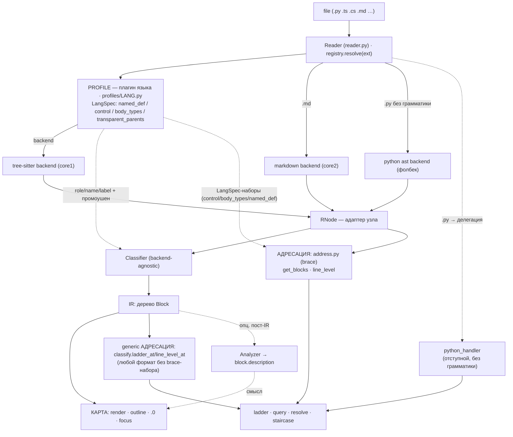

# reader/ — контракт и как добавлять слои

Этот слой превращает get_codeblock в **универсальный ридер**: `open(file) → карта`, движки под
капотом сменные. Здесь — контракт общения и рецепты расширения. Идеология и правила — в
`Vision03__get_codeblock.md` (архитектура) и `Vision02__get_codeblock.md` (`.0`-классификатор); оба
в ProjectStarter `__dev/tools/` (`../../../../__dev/tools/`).

## Схема потока

ОДИН фасад (`Reader`) → ОДНО дерево (`RNode` от backend'а) → ДВА потребителя дерева:
**КАРТА** (Classifier→IR→outline/`.0`/focus, Vision02/03) и **АДРЕСАЦИЯ** (get_blocks/line_level→
ladder/query/resolve, Vision04). У адресации ТРИ движка на выбор, по языку/формату:

1. **brace-языки** (`address._BRACE_EXTS`: ts/tsx/js/jsx/cs/cpp/css/…) — богатый reader-движок
   (`address.py`): рунги = named_def + braced-control (`for`/`if`/…) + standalone-тела. Питается
   `LangSpec`-наборами (`control`/`body_types`/`named_def`) — их у не-кодовых форматов нет.
2. **`.py`** — отступной хендлер (`handlers/python_handler.py`), сохранён осознанно: работает без
   грамматики на любом интерпретаторе (CONTEXT_RESTORE_TOOLS.md → «⭐ МИГРАЦИЯ адресации»).
3. **ЛЮБОЙ другой формат** (markdown сегодня; завтра — новый tree-sitter-язык без своего
   `_BRACE_EXTS`-входа, или core2/3 docx/pdf) — **generic `classify.ladder_at`/`line_level_at`**:
   ТА ЖЕ IR (Classifier→Block), что и у карты — landmark/frame-спуск + filler-терминал (инвариант
   #9), без brace-специфики. Это и есть цель Vision03: на его целевой схеме `ladder` — один из
   рендереров, питающихся от общего Classifier/IR, наравне с `outline`/`.0`/`query` — сегодняшняя
   реализация ЗАКРЫВАЕТ этот пункт для non-brace форматов, а не отступает от него.

Диспетчер (`Reader.get_blocks`/`line_level`) решает по РАСШИРЕНИЮ файла, не по `self.language`/
`_LANG_MAP` — та карта либа неполна для нового формата, либо молча падает на `'python'` по
умолчанию; расширение — единственный надёжный сигнал (проверено симуляцией: профиль добавлен, а
`_LANG_MAP`/`_BRACE_EXTS` — забыты, генерик всё равно подхватывает верно).



Профиль (backend + `LangSpec` + Spec-правила) — единственное языко/формато-зависимое место, и он
кормит ВСЕХ потребителей. Общее (Classifier, `address.py`, `classify.ladder_at`, `label.py`,
рендеры) — backend-agnostic.

## Карта файлов

```
reader.py     — Reader: ФАСАД (единый вход из core.py). Роутит: outline/.0 → classify;
                get_blocks/line_level → address.py (brace) ИЛИ .py → python_handler ИЛИ
                (любой другой формат) classify.ladder_at/line_level_at (по РАСШИРЕНИЮ, не
                self.language — см. «Схема потока»)
ir.py         — Block (IR: то, что потребляют рендеры карты) + Role + description(для Analyzer)
protocol.py   — контракты: RNode, Backend, Spec, Analyzer
registry.py   — resolve(ext) → (Backend, Spec)   ← ЕДИНЫЙ вход по расширению
profiles/     — плагины языков (Vision03), по файлу на язык:
  base.py       — TSProfile (данные плагина: langspec + extra_frames + binders)
  typescript.py, cpp.py, csharp.py, css.py, python.py — сами профили
  presets.py    — общие наборы (HUMAN_KIND/IMPORT_KINDS/…), чтобы C-подобные не копипастить
  __init__.py   — ts_profile_for_ext(ext) → профиль
backends/
  treesitter.py — core1: TSNode-адаптер + TSBackend + TreeSitterSpec (движок над профилем)
  markdown.py   — core2: свой разбор заголовков, БЕЗ tree-sitter (образец не-TS кора).
                  Адресуется generic'ом (`classify.ladder_at`), не своим хендлером — см. ниже.
  python_ast.py — фолбек .py без грамматики (громкий нотис; только для .0, не для адресации)
label.py      — backend-agnostic лейблер filler-полосы: band → список имён (оглавление)
classify.py   — backend-agnostic .0-классификатор (КАРТА) + focus + render + CLI + generic
                АДРЕСАЦИЯ (`ladder_at`/`line_level_at`/`filler_container_at` — Vision04 для
                НЕ-brace форматов, на той же IR, без параллельной реализации)
address.py    — backend-agnostic АДРЕСАЦИЯ brace-языков (Vision04): get_blocks/line_level на
                RNode+LangSpec. Порт handlers/_treesitter_blocks; те же границы, что у .0-outline
```

## Контракт (4 роли + IR)

- **RNode** — нормализованный узел: `type`, `start_row`, `end_row` (0-based), `children()`, `text()`,
  `field(name)`. Минимум, который нужен классификатору. (`protocol.py`)
- **Backend** — парсер: `root(source: bytes) → RNode`. (`protocol.py`)
- **Spec** — декоратор формата/языка, ВЕСЬ языкозависимый нюанс: `role/name/body/unwrap_frame/
  unwrap_def/filler_kind` (+ опц. `filler_label(nodes)` — заголовок-оглавление полосы). (`protocol.py`)
- **Profile** *(tree-sitter)* — плагин языка (`profiles/<lang>.py`): данными задаёт backend (LangSpec) +
  надстройки (`extra_frames`, binder/value-типы промоушена). `TreeSitterSpec` — тонкий движок над ним.
- **Analyzer** *(опционально)* — семантический пост-проход: `describe(block, source) → str|None`,
  кладёт смысл в `block.description`. (`protocol.py`)
- **IR = Block** — `role {landmark|filler|frame}`, `kind`, `name`, `start/end` (1-based, end incl.),
  `level`, `count`, `children`, `description`. Рендеры читают ТОЛЬКО это. (`ir.py`)

Поток: `resolve(ext) → (Backend, Spec)` → `Backend.root(bytes)` → `Classifier(Spec).classify(root)` →
`Block`-дерево → `render`.

## Конвенция вывода `.0` (зафиксировано — не переоткрывать)

Метка = обозначение УРОВНЯ, а не типа:
- **число** (`1`/`2`/…) — именованное определение (landmark) на этой глубине;
- **точка** (`.`) — «сам уровень/скоуп»: filler-строки (imports/comments/данные) И прозрачные рамки;
- **отступ** = глубина уровня; точки и числа в одной колонке; диапазоны выровнены; вывод только ASCII.

Точка — маркер уровня, НЕ признак рамки как таковой (рамка тоже точка, но точка ≠ только рамка).
Реализация — `classify.render()`.

## Batch-координаты `--line` массивом (зафиксировано REQ-001 §8 — не переоткрывать синтаксис)

`--line` принимает МАССИВ (`--line 1827,606,867`) — один файл-парс на весь вызов, не N вызовов.
`--level` и `--ancestor-level` тоже принимают массив синхронно с `--line`. **Нет новых имён
флагов** для батча — только существующие флаги научились принимать список.

**Broadcast-правило** (одно и то же для `--level` и `--ancestor-level`): одно число →
размножается на весь массив `--line`; массив короче — последнее значение размножается на
остаток; массив длиннее — лишние значения игнорируются. `--ancestor-level` побеждает `--level`,
если задан (та же семантика 0=внутренний/1=родитель, просто списком).

Три режима-глагола, по наличию `--outline`/`--query` (как и в скалярном режиме):

- **survey** (ни `--outline`, ни `--query`) — на каждый хит: полная лестница (innermost→outermost,
  как в одиночном режиме), с `[i/n] hit LINE:` префиксом. Дедуп: если лестница ХИТА побитово
  совпадает (те же `level/start/end` на каждой ступени) с уже показанной — не печатать её снова,
  вывести одну строку `[i/n] hit LINE: same ladder as [j/n] — <name> (×K hits)`, `K` — счётчик
  включая текущий хит. `<name>` — короткое имя внешней (outermost) ступени лестницы (`def`/`class`
  без сигнатуры; иначе — сам текст ступени). Лестница из ОДНОЙ ступени помечается `— top-level,
  no ladder` (строка не внутри именованного блока).
- **outline batch** (`--outline --line …`) — ОДНО объединённое дерево на весь батч, не N
  отдельных карт. Каждый хит эскалируется до своего `--level`/`--ancestor-level` (как одиночный
  focus-outline), результаты дедуплицируются по `(start, end)` и печатаются одним списком,
  отсортированным по позиции в файле — совпадающие поддеревья от разных хитов показываются один раз.
- **query batch** (`--query --line …`) — тело блока (по broadcast-адресу) на каждый хит,
  `[i/n]` индексация, framed так же как в одиночном `--query` (`#File:`/`#Block level:`/
  `#Block end:`). Один плохой хит (строка вне диапазона / нет блока / level вне диапазона) не
  роняет батч — печатает `[i/n] ERROR: …` и идёт дальше; итоговая строка `# X ok, Y error`;
  ненулевой exit-код, если `Y > 0`.

Формат-контракт (REQ-001 §4.4) не меняется батчем: метаданные — только `#`/`<!-- -->`-префиксные
строки (через `c()`), самоидентификация файла в заголовке, чистый вывод без TTY-хинтов при pipe.

**Осознанно НЕ делаем** (см. REQ-001 §8 для полного разбора): `--head` (избыточен — `--outline`
уже даёт заголовки объектов); капы размера/`--force` (структурная деградация — карта + счётчик
спрятанного, а не текстовое усечение — механики пока нет, отдельный заход); диапазоны
`--line a-b` (рассмотрели, убрали из v1 — краевые случаи вроде двух несвязанных top-level
объектов делают это отдельной мини-фичой).

— Соня5 (Claude Sonnet 5), 2026-08-24

## Адресация (Vision04) — «какой блок на строке N»

Второй потребитель дерева (`address.py`), рядом с картой. Отвечает `core.py`-режимам ladder/query
(`--line`) и функциям `get_codeblock()`/`get_line_levels()`. Вход — `Reader.get_blocks(path,line)` /
`Reader.line_level(path,idx)`.

- **get_blocks(path, line) → [{level,start,end,label}]** — лестница объемлющих блоков, внешний→
  внутренний. `resolve(blocks, level)` (в `core.py`) адресует по уровню: `0`=внутренний, `+N`=от
  верха, `-N`=вверх. `query` = get_blocks + resolve + срез текста.
- **line_level(path, idx) → int** — глубина строки: `1 + число НЕпрозрачных тел, строго её содержащих`.

**Набор узлов адресации ≠ набор карты (важно!).** `.0`/focus показывает landmark+frame (это ОГЛАВЛЕНИЕ).
Адресация БОГАЧЕ: рунги = **named_def + braced-control (`for`/`if`/`while`/`try`/`with`) + standalone-
тела (arrow/`{…}`/object/array)** — их берут из тех же `LangSpec`-наборов (`named_def`/`control`/
`body_types`). Прозрачные рамки (`transparent_parents`: namespace/extern "C") НЕ добавляют уровень
(`_level_of_row` не считает transparent-тела), как и в карте frame-дети идут на том же level.

**Конвенция границ (единая для всех движков):** блок кончается на ПОСЛЕДНЕЙ СОДЕРЖАТЕЛЬНОЙ строке
(brace — у `}`; tree-sitter — у последнего стейтмента). Хвостовые пустые/комменты — во внешнем
скоупе или (по правилу «коммент клеится к блоку ПОД ним») в преамбуле следующего блока. Так карта и
адресация дают ОДИН `[start-end]` для одного блока.

**Конец = СВОЁ тело, не хвостовой sibling-клоз.** У tree-sitter `if_statement`/`try_statement` узел
физически включает `else_clause`/`catch_clause`/`finally_clause` (грамматика хранит их как детей), а
мы адресуем эти клозы ОТДЕЛЬНЫМИ рунгами того же уровня. Поэтому конец control/named-рунга — конец
его СОБСТВЕННОГО прямого `body_types`-ребёнка (`address._own_end_row`), не `node.end_row` целиком —
иначе `if (p)` раздувается до конца чужого `else`. То же для containment-теста (какие рунги «содержат»
строку) — фильтр обязан использовать тот же собственный конец, не сырой `node.end_row`.

**Преамбула-склейка не пересекает границу ЗАКРЫТОГО sibling-тела.** Склейка комментов идёт по
физическим строкам, без учёта AST-вложенности, поэтому сама обязана остановиться на границе тела,
которое УЖЕ ЗАКРЫЛОСЬ к началу текущего блока (`address._closed_before`: `sr < row < er` И
`er ≤ target_start`) — иначе `// note\n} else {` утекал бы как преамбула следующего sibling'а,
хотя физически лежит ВНУТРИ предыдущего (`if (x) { … // note\n } else {`). Тело-ПРЕДОК, которое
ещё не закрылось (namespace/class вокруг всего) — не мешает, это его собственная легитимная
преамбула на своём уровне.

**Конвенция НАЧАЛА (преамбула, единая для всех движков):** начало блока = самая верхняя строка его
преамбулы = **декораторы (`@deco`) + непосредственно предшествующие комменты/докстринги** (пустые
строки между ними склейку НЕ рвут). Декоратор — часть определения. Это правило обязано совпадать в
ТРЁХ местах, иначе движки разойдутся стартом: адресация (`python_handler.collect_preamble` / brace
`_preamble_start`), полный outline (`classify` через `pending`), focus-outline (`_focus_head` через
`_owning_block(want_glue=True)`). У brace tree-sitter декоратор уже внутри `decorated_definition`, у
отступного Python — клеится вручную.

**`.py` без brace-модели делегирует своему хендлеру** (`Reader` ветвит по расширению — см.
«Схема потока»). Отступной `python_handler` приведён к тем же конвенциям: конец — обрезка хвоста в
`find_body_end`; начало — `collect_preamble` клеит декораторы + комменты (НЕ докстринги — см. ниже).
Многострочные скобочные конструкции (list/dict/call), которых отступная эвристика НЕ моделирует как
блок, распознаёт `enclosing_bracket_spans` — иначе строка внутри top-level литерала проваливалась бы
в «ближайший» def, НЕ содержащий её (нарушение инварианта 7). Форс `.py` через brace-`address.py`
ОТВЕРГНУТ: python-`block` начинается на строке 1-го стейтмента → строгий `_level_of_row` врёт
уровнем.

**Остальные non-brace форматы (markdown и любой будущий) адресуются generic'ом, НЕ своим хендлером.**
До этого пункта `.md` тоже делегировал бы `markdown_handler` — но у markdown, в отличие от Python,
УЖЕ есть полноценный Backend+Spec для карты (`backends/markdown.py`, core2), просто адресация к нему
не была подключена. `classify.ladder_at`/`line_level_at` — тот же `_containing_chain`, что использует
focus-outline, только развёрнутый в форму рунга `get_blocks`. Работает для ЛЮБОГО Spec без единой
строки нового кода (нужен только рабочий backend, per Рецепт B) — именно поэтому markdown НЕ получил
своего `_orphan`/особого хендлера: это была бы вторая, дублирующая реализация того же самого.

## ⚠️ Инварианты (нарушать нельзя)

1. **Рендеры и classify — backend-agnostic.** Новый формат НЕ трогает `classify.py`/рендер.
2. **Всё через `registry.resolve`.** Никаких частных путей в обход единого входа.
3. **Backend отдаёт СТРУКТУРУ, Analyzer — СМЫСЛ.** Backend не ставит `description`; Analyzer не меняет
   `role/range/children`.
4. **Analyzer опционален и чист.** Его отсутствие/падение не ломает пайплайн.
5. **Общие `LangSpec` (в `handlers/`) не менять** — на них завязан рабочий outline/query (оракул
   90/90). Языковые «добавки» ридера держать в профиле (`profiles/<lang>.py`: `extra_frames`, binders).
6. **Карта и адресация согласованы (Vision04).** Один вопрос «какой блок на строке N» — один ответ.
   Границы блока совпадают в `.0`-outline, focus-outline и `get_blocks` — И конец (последняя
   содержательная строка), И начало (преамбула: декораторы + комменты, см. «Конвенцию НАЧАЛА»).
   Никаких параллельных реализаций адресации в обход `Reader`.
7. **Выданный блок ОБЯЗАН содержать строку.** Любой рунг `get_blocks(path, line)` удовлетворяет
   `start ≤ line ≤ end`. «Ближайший» блок, не покрывающий строку, — запрещён (был баг: отступная
   эвристика на строке внутри top-level списка И brace-`_nearest` на строке вне всех блоков — импорт,
   top-level type/const). Нет настоящего контейнера — честный file-scope `[1, N]`, не выдуманный
   сосед. ОБА пути соблюдают: отступной — `python_handler._orphan`, brace — фолбек в `address.get_blocks`.
   Фуззер `test/sweep_invariants.py` протыкивает непустые строки всех фикстур и стережёт этот инвариант.
8. **Общий physical-line-boundary между siblings — не баг, а честно показывается.** Одна физическая
   строка может быть одновременно концом одного блока и началом следующего (`} else {`, `} catch (e)
   {`) — оба СИБЛИНГА, оба на одном уровне, оба легитимно содержат эту строку. Лестница `get_blocks`
   показывает ОБА рунга как есть (не сливает, не выдумывает искусственную вложенность). Но «текущий
   блок» (уровень 0 / дефолтный `--query` без `--level`) на такой строке НЕОДНОЗНАЧЕН — нет «более
   внутреннего» кандидата, обе стороны на одном уровне. `core.resolve(blocks, 0)` разруливает это
   подъёмом к родителю: `_innermost_unambiguous_idx` пропускает весь тай-блок одноуровневых рунгов и
   берёт ближайший уровень, за который отвечает ровно один рунг. Fuzzer различает это явно: `SIBLING`
   (INFO, не баг — граница совпала с целевой строкой) vs `RANGE` (HIGH — реальный разрыв диапазонов).
9. **Filler-полоса — легитимный контейнер, НЕ ТОЛЬКО на уровне файла.** До этого пункта инвариант #7
   трактовал «нет настоящего контейнера» буквально: если строка не внутри named_def/control/
   standalone-тела — сразу честный file-scope `[1,N]`. Но `--outline`/`--dot` УЖЕ показывают для этой
   же строки узкую filler-полосу (`imports: …`, `~docstring`, `assign: …`, комментарий) — та же
   структурная сущность, просто безымянная (Role.FILLER, не LANDMARK). Она и есть настоящий контейнер:
   `get_blocks` обязан её вернуть, а не перепрыгивать сразу к file-scope. Работает на ЛЮБОМ скоупе —
   на уровне файла («.») и внутри прозрачной рамки (namespace/`extern "C"`, «.2» и глубже), не только
   на уровне 1: рамка сама не адресуема (не даёт своего рунга), поэтому её собственный filler — тоже
   единственный настоящий контейнер для строк напрямую в ней.

   **Расширение: filler ЕЩЁ ОДНИМ, более внутренним рунгом, даже когда охватывающий блок УЖЕ
   найден.** Landmark (def/class) сам адресуем и содержит строку — но ВНУТРИ его тела может сидеть
   более узкая filler-полоса, которая своего control/named_def-рунга не заводит (поле класса, обычный
   стейтмент, `--dot` её и так показывает на уровень глубже родителя). Если она СТРОГО уже последнего
   найденного рунга (не совпадает с ним целиком) — это честный ещё более внутренний контейнер, и
   `get_blocks` обязан добавить его как дополнительный, самый внутренний рунг лестницы — иначе дефолтный
   `--query` (level 0) отдаёт слишком широкий блок, хотя строка попадает в куда более узкий читаемый
   кусок (тот же принцип: «в какой блок нас привёл бы грепом» должен быть точным на любой глубине, не
   только на файловом уровне). Level нового рунга = `level` охватывающего + 1 (не level из classify —
   там своя, не всегда совпадающая нумерация из-за control-блоков, которых classify не разворачивает).
   Реализация — ОДНА (backend-agnostic): `classify.filler_container_at(path, line)` гоняет ту же
   Classifier-группировку, что рисует карту (никакого параллельного пересчёта границ/лейблов), и
   используется как fallback ПЕРЕД честным `[1,N]` — в `address.get_blocks` (brace) и
   `python_handler._orphan` (отступной Python, отдельный парс через tree-sitter-python/ast-фолбек).
   Тот же примитив расширяет focus-цепочку `_containing_chain`/`outline_rows` (`--outline --line N`/
   `--dot --line N`): раньше строка в filler'е давала «no block found», теперь — её полосу.
   Честный `[1,N]` остаётся последним рубежом, если даже filler не нашёлся (не должно случаться на
   непустой строке, но защитно оставлен).

## Неподдержанный формат (расширение без профиля)

`registry.resolve(ext)` — ЕДИНСТВЕННОЕ место, которое ЗНАЕТ, поддержан ли формат: `.md`/`.py`
захардкожены, остальное идёт через `profiles.ts_profile_for_ext(ext)`, и если профиля нет — `raise
ValueError`. `core.py`'s собственный `lang_map` (одна из «3 копий», см. «Карта файлов») тут не
помощник: он для НЕИЗВЕСТНОГО расширения молча подставляет `'python'` (нужен для preflight
`ensure_language`/выбора комментария в выводе, не для реальной поддержки формата) — значит сам факт
успешного `Reader.open()` НИЧЕГО не говорит о том, поддержан ли РЕАЛЬНЫЙ формат файла.

**Поведение (сделано `core.py`, отдельный preflight сразу после `ensure_language`):** явный вызов
`registry.resolve(ext)` до какой-либо реальной работы; `ValueError` → чистое сообщение в stderr
(`Error: file format '.rs' is not supported yet…`) + `exit(1)`. БЕЗ этого преflight-а ошибка
всплывала бы голым traceback'ом глубоко внутри `outline_rows`/`ladder_at`/`address.get_blocks` —
несколько мест кидали бы одно и то же `ValueError` по-разному по стеку, лечить в одном месте (здесь)
проще и надёжнее, чем ловить в каждом потребителе `resolve()`.

**НЕ пытаемся угадать «похожий» язык.** Перенаправить `.rs`/`.go`/`.yaml` на грамматику ДРУГОГО
языка (C++/TS/…) не работает добросовестно: node-типы в дереве СПЕЦИФИЧНЫ для грамматики (`fn`/
`func`/`class` — разные узлы в разных грамматиках), а `LangSpec`-наборы (`named_def`/`control`/
`body_types`) языка-донора их не узнают — на выходе или сплошные `ERROR`-узлы там, где синтаксис
расходится, или тихо неверная структура (хуже, чем честный отказ). Формат-агностичного «более
безопасного» фолбека тоже НЕТ (пока) — только явная поддержка через профиль/backend (Рецепт A/B).

Новый файл-профиль `profiles/<lang>.py` + одна строка в `profiles/__init__.py`. Профиль несёт
`LangSpec` (наборы node-типов: `named_def`→landmark, `transparent_parents`/`extra_frames`→frame,
`body_types`→тело, `control`→управляющие блоки) и, при нужде, binder/value-типы промоушена. Движок,
classify, `address.py`, рендер, `label.py` — НЕ трогаем. Общие label-наборы (если правило делит
несколько языков) — в `profiles/presets.py`.

**Один `LangSpec` → и КАРТА, и АДРЕСАЦИЯ бесплатно.** Те же наборы (`named_def`/`control`/`body_types`/
`transparent_parents`) читают ОБА потребителя: `.0`-классификатор строит карту, `address.py` —
ladder/query/line_level. Новый brace-язык — ДВА касания, и получаешь outline + `.0` + focus +
get_blocks + query + staircase:
1. `profiles/<lang>.py` (`LangSpec`) + строка в `profiles/__init__.py` — включает КАРТУ.
2. расширение в `address._BRACE_EXTS` — включает АДРЕСАЦИЮ на reader-движке.

Без шага 2 карта работает, но `Reader` уведёт адресацию в делегацию к языковому хендлеру
(`handlers/`) — которого у нового языка нет. Оба шага — просто ДАННЫЕ, ни движок, ни рендеры не
трогаем (Vision03: «новый язык = запись данных»).

```python
# profiles/rust.py
from ..handlers._treesitter_blocks import LangSpec
from .base import TSProfile

def _load_rust():
    import tree_sitter_rust
    from tree_sitter import Language
    return Language(tree_sitter_rust.language())

RUST = TSProfile(LangSpec("Rust", _load_rust, body_types={'block','declaration_list'},
    transparent_parents={'mod_item'}, named_def={'function_item','struct_item','enum_item',
    'impl_item','trait_item'}, container={'mod_item'},
    control={'if_expression','for_expression','while_expression','match_expression'},
    scope_body='block'))

# profiles/__init__.py:  if ext == '.rs': from .rust import RUST; return RUST
```

## Рецепт B — новый backend (не tree-sitter: plain-text, docx, pdf…)

Реализовать три вещи и подключить в `resolve`. Образец — `backends/markdown.py`.

```python
class MyNode:            # RNode: type,start_row,end_row,children(),text(),field()
    ...
class MyBackend:         # root(source: bytes) -> MyNode  (сам строит дерево)
    def root(self, source): ...
class MySpec:            # role/name/body/unwrap_frame/unwrap_def/filler_kind над MyNode
    ...
# registry.resolve:
if ext in ('.txt',):
    from .backends.mytext import MyBackend, MySpec
    return MyBackend(), MySpec()
```

Backend строит `RNode`-дерево так, чтобы `Spec` мог назвать роли: заголовок/раздел → landmark,
абзац/шум → filler, прозрачная обёртка → frame. Дальше classify/render — общие.

**Адресация (`--line`/ladder/query) — БЕСПЛАТНО, без строчки нового кода.** Не нужно писать
`get_blocks`/`line_level` для нового формата и не нужно ничего трогать в `Reader` — раз `ext` не
попадает в `address._BRACE_EXTS` и не `.py`, `Reader` сам роутит на `classify.ladder_at`/
`line_level_at` (см. «Схема потока»), которые работают через ТОТ ЖЕ `Spec`, что и карта. Единственное
требование — корректные `unwrap_frame`/`unwrap_def`/`body`/`filler_kind` (то, что уже нужно для
`--outline`). Добавлять `_BRACE_EXTS`/особый хендлер НЕ нужно, если формат не кодовый (нет
control-блоков/standalone-тел) — generic-лестница и есть правильный уровень детализации.

## Рецепт C — новый analyzer (пласт 2, семантика)

Чистая функция над готовым блоком; вешается пост-проходом (обходит `Block`-дерево, ставит
`description`). Ничего в структуре не меняет.

```python
class LicenseAnalyzer:   # protocol.Analyzer
    def describe(self, block, source):
        if block.role is Role.FILLER and block.kind in ('comment','content'):
            head = "\n".join(source.splitlines()[block.start-1:block.end])
            if re.search(r'Copyright|SPDX-License', head):
                return "license-блок"
        return None
```

Прогонять опционально: нет анализатора → блоки рендерятся структурным лейблом (инвариант 4).

## Ссылки на главные правила

- `../../../../__dev/tools/Vision03__get_codeblock.md` — архитектура универсального ридера, швы.
- `../../../../__dev/tools/Vision02__get_codeblock.md` — `.0`-классификатор, роли landmark/filler/frame.
- `../../../../__dev/tools/Plan__universal-reader.md` — фазы реализации.
- `protocol.py` — сами контракты (истина в коде).
