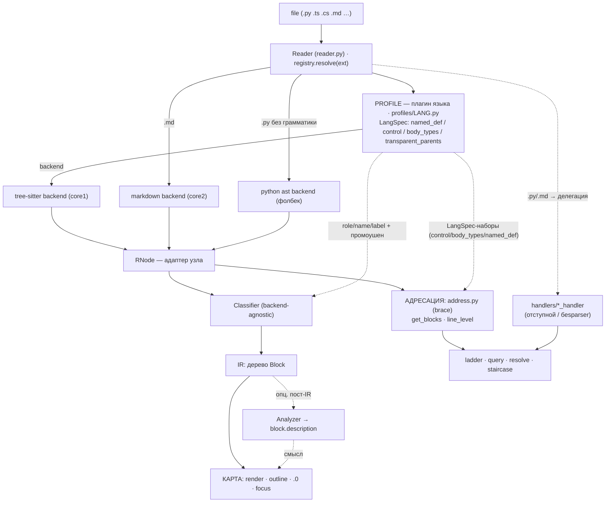

# reader/ — контракт и как добавлять слои

Этот слой превращает get_codeblock в **универсальный ридер**: `open(file) → карта`, движки под
капотом сменные. Здесь — контракт общения и рецепты расширения. Идеология и правила — в
`Vision03__get_codeblock.md` (архитектура) и `Vision02__get_codeblock.md` (`.0`-классификатор); оба
в ProjectStarter `__dev/tools/` (`../../../../__dev/tools/`).

## Схема потока

ОДИН фасад (`Reader`) → ОДНО дерево (`RNode` от backend'а) → ДВА потребителя дерева:
**КАРТА** (Classifier→IR→outline/`.0`/focus, Vision02/03) и **АДРЕСАЦИЯ** (`address.py`→get_blocks/
line_level→ladder/query/resolve, Vision04). Оба питаются одним ПРОФИЛЕМ языка — его `LangSpec`
(наборы node-типов) обслуживает и классификатор, и адресацию.



Профиль (backend + `LangSpec` + Spec-правила) — единственное языко/формато-зависимое место, и он
кормит ОБА потребителя. Общее (Classifier, `address.py`, `label.py`, рендеры) — backend-agnostic.

## Карта файлов

```
reader.py     — Reader: ФАСАД (единый вход из core.py). Роутит: outline/.0 → classify;
                get_blocks/line_level → address.py (brace) ИЛИ делегация хендлеру (.py/.md)
ir.py         — Block (IR: то, что потребляют рендеры карты) + Role + description(для Analyzer)
protocol.py   — контракты: RNode, Backend, Spec, Analyzer
registry.py   — resolve(ext) → (Backend, Spec)   ← ЕДИНЫЙ вход по расширению
profiles/     — плагины языков (Vision03), по файлу на язык:
  base.py       — TSProfile (данные плагина: langspec + extra_frames + binders)
  typescript.py, cpp.py, csharp.py, css.py, python.py — сами профили
  presets.py    — общие наборы (HUMAN_KIND/IMPORT_KINDS/…), чтобы C-подобные не копипастить
  __init__.py   — ts_profile_for_ext(ext) → профиль
backends/
  treesitter.py — core1: TSNode-адаптер + TSBackend + TreeSitterSpec (движок над профилем)
  markdown.py   — core2: свой разбор заголовков, БЕЗ tree-sitter (образец не-TS кора)
  python_ast.py — фолбек .py без грамматики (громкий нотис; только для .0, не для адресации)
label.py      — backend-agnostic лейблер filler-полосы: band → список имён (оглавление)
classify.py   — backend-agnostic .0-классификатор (КАРТА) + focus + render + CLI
address.py    — backend-agnostic АДРЕСАЦИЯ brace-языков (Vision04): get_blocks/line_level на
                RNode+LangSpec. Порт handlers/_treesitter_blocks; те же границы, что у .0-outline
```

## Контракт (4 роли + IR)

- **RNode** — нормализованный узел: `type`, `start_row`, `end_row` (0-based), `children()`, `text()`,
  `field(name)`. Минимум, который нужен классификатору. (`protocol.py`)
- **Backend** — парсер: `root(source: bytes) → RNode`. (`protocol.py`)
- **Spec** — декоратор формата/языка, ВЕСЬ языкозависимый нюанс: `role/name/body/unwrap_frame/
  unwrap_def/filler_kind` (+ опц. `filler_label(nodes)` — заголовок-оглавление полосы). (`protocol.py`)
- **Profile** *(tree-sitter)* — плагин языка (`profiles/<lang>.py`): данными задаёт backend (LangSpec) +
  надстройки (`extra_frames`, binder/value-типы промоушена). `TreeSitterSpec` — тонкий движок над ним.
- **Analyzer** *(опционально)* — семантический пост-проход: `describe(block, source) → str|None`,
  кладёт смысл в `block.description`. (`protocol.py`)
- **IR = Block** — `role {landmark|filler|frame}`, `kind`, `name`, `start/end` (1-based, end incl.),
  `level`, `count`, `children`, `description`. Рендеры читают ТОЛЬКО это. (`ir.py`)

Поток: `resolve(ext) → (Backend, Spec)` → `Backend.root(bytes)` → `Classifier(Spec).classify(root)` →
`Block`-дерево → `render`.

## Конвенция вывода `.0` (зафиксировано — не переоткрывать)

Метка = обозначение УРОВНЯ, а не типа:
- **число** (`1`/`2`/…) — именованное определение (landmark) на этой глубине;
- **точка** (`.`) — «сам уровень/скоуп»: filler-строки (imports/comments/данные) И прозрачные рамки;
- **отступ** = глубина уровня; точки и числа в одной колонке; диапазоны выровнены; вывод только ASCII.

Точка — маркер уровня, НЕ признак рамки как таковой (рамка тоже точка, но точка ≠ только рамка).
Реализация — `classify.render()`.

## Адресация (Vision04) — «какой блок на строке N»

Второй потребитель дерева (`address.py`), рядом с картой. Отвечает `core.py`-режимам ladder/query
(`--line`) и функциям `get_codeblock()`/`get_line_levels()`. Вход — `Reader.get_blocks(path,line)` /
`Reader.line_level(path,idx)`.

- **get_blocks(path, line) → [{level,start,end,label}]** — лестница объемлющих блоков, внешний→
  внутренний. `resolve(blocks, level)` (в `core.py`) адресует по уровню: `0`=внутренний, `+N`=от
  верха, `-N`=вверх. `query` = get_blocks + resolve + срез текста.
- **line_level(path, idx) → int** — глубина строки: `1 + число НЕпрозрачных тел, строго её содержащих`.

**Набор узлов адресации ≠ набор карты (важно!).** `.0`/focus показывает landmark+frame (это ОГЛАВЛЕНИЕ).
Адресация БОГАЧЕ: рунги = **named_def + braced-control (`for`/`if`/`while`/`try`/`with`) + standalone-
тела (arrow/`{…}`/object/array)** — их берут из тех же `LangSpec`-наборов (`named_def`/`control`/
`body_types`). Прозрачные рамки (`transparent_parents`: namespace/extern "C") НЕ добавляют уровень
(`_level_of_row` не считает transparent-тела), как и в карте frame-дети идут на том же level.

**Конвенция границ (единая для всех движков):** блок кончается на ПОСЛЕДНЕЙ СОДЕРЖАТЕЛЬНОЙ строке
(brace — у `}`; tree-sitter — у последнего стейтмента). Хвостовые пустые/комменты — во внешнем
скоупе или (по правилу «коммент клеится к блоку ПОД ним») в преамбуле следующего блока. Так карта и
адресация дают ОДИН `[start-end]` для одного блока.

**Конвенция НАЧАЛА (преамбула, единая для всех движков):** начало блока = самая верхняя строка его
преамбулы = **декораторы (`@deco`) + непосредственно предшествующие комменты/докстринги** (пустые
строки между ними склейку НЕ рвут). Декоратор — часть определения. Это правило обязано совпадать в
ТРЁХ местах, иначе движки разойдутся стартом: адресация (`python_handler.collect_preamble` / brace
`_preamble_start`), полный outline (`classify` через `pending`), focus-outline (`_focus_head` через
`_owning_block(want_glue=True)`). У brace tree-sitter декоратор уже внутри `decorated_definition`, у
отступного Python — клеится вручную.

**Backend'ы без brace-модели делегируют.** `.py` (отступной) и `.md` (беsparser) идут своим хендлером
(`Reader` ветвит по `address.supports(path)` — whitelist `_BRACE_EXTS`). Отступной `python_handler`
приведён к тем же конвенциям: конец — обрезка хвоста в `find_body_end`; начало — `collect_preamble`
клеит декораторы + комменты. Многострочные скобочные конструкции (list/dict/call), которых отступная
эвристика НЕ моделирует как блок, распознаёт `enclosing_bracket_spans` — иначе строка внутри top-level
литерала проваливалась бы в «ближайший» def, НЕ содержащий её (нарушение инварианта 7). Форс `.py`
через brace-`address.py` ОТВЕРГНУТ: python-`block` начинается на строке 1-го стейтмента → строгий
`_level_of_row` врёт уровнем.

## ⚠️ Инварианты (нарушать нельзя)

1. **Рендеры и classify — backend-agnostic.** Новый формат НЕ трогает `classify.py`/рендер.
2. **Всё через `registry.resolve`.** Никаких частных путей в обход единого входа.
3. **Backend отдаёт СТРУКТУРУ, Analyzer — СМЫСЛ.** Backend не ставит `description`; Analyzer не меняет
   `role/range/children`.
4. **Analyzer опционален и чист.** Его отсутствие/падение не ломает пайплайн.
5. **Общие `LangSpec` (в `handlers/`) не менять** — на них завязан рабочий outline/query (оракул
   90/90). Языковые «добавки» ридера держать в профиле (`profiles/<lang>.py`: `extra_frames`, binders).
6. **Карта и адресация согласованы (Vision04).** Один вопрос «какой блок на строке N» — один ответ.
   Границы блока совпадают в `.0`-outline, focus-outline и `get_blocks` — И конец (последняя
   содержательная строка), И начало (преамбула: декораторы + комменты, см. «Конвенцию НАЧАЛА»).
   Никаких параллельных реализаций адресации в обход `Reader`.
7. **Выданный блок ОБЯЗАН содержать строку.** Любой рунг `get_blocks(path, line)` удовлетворяет
   `start ≤ line ≤ end`. «Ближайший» блок, не покрывающий строку, — запрещён (был баг: отступная
   эвристика на строке внутри top-level списка И brace-`_nearest` на строке вне всех блоков — импорт,
   top-level type/const). Нет настоящего контейнера — честный file-scope `[1, N]`, не выдуманный
   сосед. ОБА пути соблюдают: отступной — `python_handler._orphan`, brace — фолбек в `address.get_blocks`.
   Фуззер `test/sweep_invariants.py` протыкивает непустые строки всех фикстур и стережёт этот инвариант.

## Рецепт A — новый язык на tree-sitter

Новый файл-профиль `profiles/<lang>.py` + одна строка в `profiles/__init__.py`. Профиль несёт
`LangSpec` (наборы node-типов: `named_def`→landmark, `transparent_parents`/`extra_frames`→frame,
`body_types`→тело, `control`→управляющие блоки) и, при нужде, binder/value-типы промоушена. Движок,
classify, `address.py`, рендер, `label.py` — НЕ трогаем. Общие label-наборы (если правило делит
несколько языков) — в `profiles/presets.py`.

**Один `LangSpec` → и КАРТА, и АДРЕСАЦИЯ бесплатно.** Те же наборы (`named_def`/`control`/`body_types`/
`transparent_parents`) читают ОБА потребителя: `.0`-классификатор строит карту, `address.py` —
ladder/query/line_level. Новый brace-язык — ДВА касания, и получаешь outline + `.0` + focus +
get_blocks + query + staircase:
1. `profiles/<lang>.py` (`LangSpec`) + строка в `profiles/__init__.py` — включает КАРТУ.
2. расширение в `address._BRACE_EXTS` — включает АДРЕСАЦИЮ на reader-движке.

Без шага 2 карта работает, но `Reader` уведёт адресацию в делегацию к языковому хендлеру
(`handlers/`) — которого у нового языка нет. Оба шага — просто ДАННЫЕ, ни движок, ни рендеры не
трогаем (Vision03: «новый язык = запись данных»).

```python
# profiles/rust.py
from ..handlers._treesitter_blocks import LangSpec
from .base import TSProfile

def _load_rust():
    import tree_sitter_rust
    from tree_sitter import Language
    return Language(tree_sitter_rust.language())

RUST = TSProfile(LangSpec("Rust", _load_rust, body_types={'block','declaration_list'},
    transparent_parents={'mod_item'}, named_def={'function_item','struct_item','enum_item',
    'impl_item','trait_item'}, container={'mod_item'},
    control={'if_expression','for_expression','while_expression','match_expression'},
    scope_body='block'))

# profiles/__init__.py:  if ext == '.rs': from .rust import RUST; return RUST
```

## Рецепт B — новый backend (не tree-sitter: plain-text, docx, pdf…)

Реализовать три вещи и подключить в `resolve`. Образец — `backends/markdown.py`.

```python
class MyNode:            # RNode: type,start_row,end_row,children(),text(),field()
    ...
class MyBackend:         # root(source: bytes) -> MyNode  (сам строит дерево)
    def root(self, source): ...
class MySpec:            # role/name/body/unwrap_frame/unwrap_def/filler_kind над MyNode
    ...
# registry.resolve:
if ext in ('.txt',):
    from .backends.mytext import MyBackend, MySpec
    return MyBackend(), MySpec()
```

Backend строит `RNode`-дерево так, чтобы `Spec` мог назвать роли: заголовок/раздел → landmark,
абзац/шум → filler, прозрачная обёртка → frame. Дальше classify/render — общие.

## Рецепт C — новый analyzer (пласт 2, семантика)

Чистая функция над готовым блоком; вешается пост-проходом (обходит `Block`-дерево, ставит
`description`). Ничего в структуре не меняет.

```python
class LicenseAnalyzer:   # protocol.Analyzer
    def describe(self, block, source):
        if block.role is Role.FILLER and block.kind in ('comment','content'):
            head = "\n".join(source.splitlines()[block.start-1:block.end])
            if re.search(r'Copyright|SPDX-License', head):
                return "license-блок"
        return None
```

Прогонять опционально: нет анализатора → блоки рендерятся структурным лейблом (инвариант 4).

## Ссылки на главные правила

- `../../../../__dev/tools/Vision03__get_codeblock.md` — архитектура универсального ридера, швы.
- `../../../../__dev/tools/Vision02__get_codeblock.md` — `.0`-классификатор, роли landmark/filler/frame.
- `../../../../__dev/tools/Plan__universal-reader.md` — фазы реализации.
- `protocol.py` — сами контракты (истина в коде).
