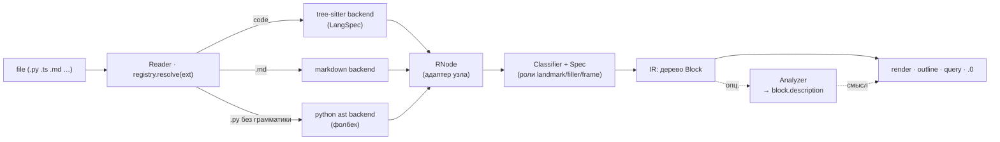

# reader/ — контракт и как добавлять слои

Этот слой превращает get_codeblock в **универсальный ридер**: `open(file) → карта`, движки под
капотом сменные. Здесь — контракт общения и рецепты расширения. Идеология и правила — в
`Vision03__get_codeblock.md` (архитектура) и `Vision02__get_codeblock.md` (`.0`-классификатор); оба
в ProjectStarter `__dev/tools/` (`../../../../__dev/tools/`).

## Схема потока



Backend/Spec — единственное языко/формато-зависимое место. Всё правее IR — общее.

## Карта файлов

```
ir.py         — Block (IR: то, что потребляют рендеры) + Role + description(для Analyzer)
protocol.py   — контракты: RNode, Backend, Spec, Analyzer
registry.py   — resolve(ext) → (Backend, Spec)   ← ЕДИНЫЙ вход
backends/
  treesitter.py — core1: TSNode-адаптер + TSBackend + TreeSitterSpec (обёртка LangSpec)
  markdown.py   — core2: свой разбор заголовков, БЕЗ tree-sitter (образец не-TS кора)
classify.py   — backend-agnostic .0-классификатор + render + CLI
```

## Контракт (4 роли + IR)

- **RNode** — нормализованный узел: `type`, `start_row`, `end_row` (0-based), `children()`, `text()`,
  `field(name)`. Минимум, который нужен классификатору. (`protocol.py`)
- **Backend** — парсер: `root(source: bytes) → RNode`. (`protocol.py`)
- **Spec** — декоратор формата/языка, ВЕСЬ языкозависимый нюанс: `role/name/body/unwrap_frame/
  unwrap_def/filler_kind`. (`protocol.py`)
- **Analyzer** *(опционально)* — семантический пост-проход: `describe(block, source) → str|None`,
  кладёт смысл в `block.description`. (`protocol.py`)
- **IR = Block** — `role {landmark|filler|frame}`, `kind`, `name`, `start/end` (1-based, end incl.),
  `level`, `count`, `children`, `description`. Рендеры читают ТОЛЬКО это. (`ir.py`)

Поток: `resolve(ext) → (Backend, Spec)` → `Backend.root(bytes)` → `Classifier(Spec).classify(root)` →
`Block`-дерево → `render`.

## ⚠️ Инварианты (нарушать нельзя)

1. **Рендеры и classify — backend-agnostic.** Новый формат НЕ трогает `classify.py`/рендер.
2. **Всё через `registry.resolve`.** Никаких частных путей в обход единого входа.
3. **Backend отдаёт СТРУКТУРУ, Analyzer — СМЫСЛ.** Backend не ставит `description`; Analyzer не меняет
   `role/range/children`.
4. **Analyzer опционален и чист.** Его отсутствие/падение не ломает пайплайн.
5. **Общие `LangSpec` (в `handlers/`) не менять** — на них завязан рабочий outline/query (оракул
   88/88). Языковые «добавки» ридера держать локально (см. `_EXTRA_FRAME_TYPES` в `treesitter.py`).

## Рецепт A — новый язык на tree-sitter

Одна запись в `registry._langspec_for_ext`. Если грамматика новая — `LangSpec` с наборами node-типов
(`named_def` → landmark, `transparent_parents`/локальные extra → frame, `body_types` → тело). Backend,
Spec, classify, рендер — НЕ трогаем.

```python
# registry.py, внутри _langspec_for_ext
if ext == '.rs':
    from ..handlers._treesitter_blocks import LangSpec
    return LangSpec("Rust", _load_rust, body_types={'block','declaration_list'},
                    transparent_parents={'mod_item'}, named_def={'function_item','struct_item',
                    'enum_item','impl_item','trait_item'}, container={'mod_item'},
                    control={'if_expression','for_expression','while_expression','match_expression'},
                    scope_body='block')
```

## Рецепт B — новый backend (не tree-sitter: plain-text, docx, pdf…)

Реализовать три вещи и подключить в `resolve`. Образец — `backends/markdown.py`.

```python
class MyNode:            # RNode: type,start_row,end_row,children(),text(),field()
    ...
class MyBackend:         # root(source: bytes) -> MyNode  (сам строит дерево)
    def root(self, source): ...
class MySpec:            # role/name/body/unwrap_frame/unwrap_def/filler_kind над MyNode
    ...
# registry.resolve:
if ext in ('.txt',):
    from .backends.mytext import MyBackend, MySpec
    return MyBackend(), MySpec()
```

Backend строит `RNode`-дерево так, чтобы `Spec` мог назвать роли: заголовок/раздел → landmark,
абзац/шум → filler, прозрачная обёртка → frame. Дальше classify/render — общие.

## Рецепт C — новый analyzer (пласт 2, семантика)

Чистая функция над готовым блоком; вешается пост-проходом (обходит `Block`-дерево, ставит
`description`). Ничего в структуре не меняет.

```python
class LicenseAnalyzer:   # protocol.Analyzer
    def describe(self, block, source):
        if block.role is Role.FILLER and block.kind in ('comment','content'):
            head = "\n".join(source.splitlines()[block.start-1:block.end])
            if re.search(r'Copyright|SPDX-License', head):
                return "license-блок"
        return None
```

Прогонять опционально: нет анализатора → блоки рендерятся структурным лейблом (инвариант 4).

## Ссылки на главные правила

- `../../../../__dev/tools/Vision03__get_codeblock.md` — архитектура универсального ридера, швы.
- `../../../../__dev/tools/Vision02__get_codeblock.md` — `.0`-классификатор, роли landmark/filler/frame.
- `../../../../__dev/tools/Plan__universal-reader.md` — фазы реализации.
- `protocol.py` — сами контракты (истина в коде).
