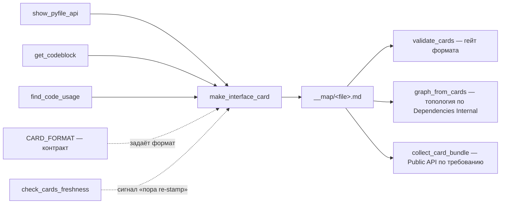

# make_interface_card — штемпель карточки-интерфейса

## Цель инструмента

Не анализатор — **оркестратор трёх уже существующих источников фактов** в один файл строгого
формата (`CARD_FORMAT.py`). Карточка — «первая компиляция» файла для проекта ProjectStarter:
что он экспортирует, кто это реально использует, откуда берёт зависимости — плюс проза человека
поверх фактов (описание, «как работает», расхождения с докстрингом). Философия и место карточек
в схеме — `__dev/vision/Vision02__cards-layer.md`.

Три факта, которые тул СОБИРАЕТ (не выдумывает):

1. **Declared surface + signatures** — что файл объявляет наружу. Python — `show_pyfile_api.collect`
   (`ast`, точные типы параметров); TS/JS/C# — `get_codeblock`'овские декларации (tree-sitter или
   regex-бэкенд, см. ниже).
2. **Consumed surface** — кто РЕАЛЬНО импортирует каждый символ (`find_code_usage.scan_downstream`).
   `consumers 0` на объявленном публичном имени — сигнал: либо мёртвый код, либо API для внешнего
   потребителя вне зоны сканирования.
3. **Dependencies** — куда файл сам ходит (`find_code_usage.scan_incoming`), резолвленные до файлов
   (не просто имён модулей) — это и есть рёбра графа проекта (`graph_from_cards`).

Автор карточки — не человек и не ЛЛМ с нуля: тул штемпелит факт-скелет, ЛЛМ дописывает **только**
прозу (директивы `<|Agent:NN … |>` — единый маркер, см. `CARD_FORMAT.py`). При повторном стампе
(файл поменялся) факты пересчитываются заново, а написанная человеком проза **переносится** —
это и есть самая важная и самая хрупкая часть тула (см. ниже, «Merge»).

---

## Инструкция по использованию

**Target:** `make_interface_card.py <file> --project-root R [--out PATH] [--force [--discard-prose]]`

```bash
make_interface_card.py <f>.py --project-root .                          # preview to stdout, no write
make_interface_card.py <f>.py --project-root . --out __map/<f>.py.md    # stamp -> write card (NEW)
make_interface_card.py <f>.py --project-root . --out <card>             # re-stamp: MERGE (default)
make_interface_card.py <f>.py --project-root . --out <card> --force               # RESET (только если карточка ещё пустая)
make_interface_card.py <f>.py --project-root . --out <card> --force --discard-prose  # RESET, было заполнено — подтверждение
make_interface_card.py --all                                            # bulk: всё дерево, CONFIG LANGUAGE
make_interface_card.py --all --language py,ts                           # bulk: полиглот-дерево (или 'all')
```

| Параметр | Описание |
|---|---|
| `<file>` | Путь к исходнику (root-relative или абсолютный); опускается вместе с `--all` |
| `--project-root R` | Корень для обратного индекса (`find_code_usage`) и резолва путей |
| `--out PATH` | Куда писать карточку. Без него — печать в stdout, без merge (не с чем сравнивать) |
| `--force` | Сброс вместо merge — см. секцию «Force и guard» ниже |
| `--discard-prose` | Подтверждение `--force` на карточке, где УЖЕ есть проза (без него — отказ, exit 2) |
| `--all` | Массовый проход по всему `--project-root`, каждый файл → `__map/<path>.md` |
| `--language L` | Только под `--all`: список языков (иначе `CONFIG__TOOLS.LANGUAGE`); полиглот-репо без этого молча теряет второй язык |

Без `--file`/`--all` — ошибка usage, exit 1. `--all` игнорирует `<file>` и `--out`.

---

## Механизм: как собирается свежий (не merge) штемпель

1. **Определить язык** файла по расширению (`_lang`) → выбрать бэкенд деклараций.
2. **`_declared()`** — Python через `show_pyfile_api.collect` (ast); TS/JS/C# через `_declarations()`:
   tree-sitter, если `CONFIG__TOOLS.DECL_BACKEND` = `auto`/`treesitter` И грамматика установлена,
   иначе regex-фоллбек с одноразовым stderr-предупреждением (какой pip-пакет поставить). Python
   всегда идёт через `ast` — бэкенд-развилки не касается.
3. **`consumers_of()`** — по каждому объявленному имени: кто его реально импортирует
   (`find_code_usage.core.scan_downstream`). Также ловит «утёкший интерфейс» — `_`-приватные имена,
   которые НЕ в объявленном экспорте, но реально импортируются извне (`### Consumed internals`).
4. **`deps_of()`** — резолв импортов файла до конкретных файлов проекта (`find_code_usage.core.scan_incoming`)
   → таблица `## Dependencies Internal` (колонка `File Path` — это и есть рёбра для `graph_from_cards`).
5. **Пакетные карточки** (`__init__.py` и языковые индексы, `CARD_FORMAT.is_package`) получают
   дополнительно `## Package layout` и `### Re-exports` — что реэкспортируется наружу из соседних
   модулей фасада.
6. Собранный текст прогоняется через `CARD_FORMAT.number_directives` — все `<|Agent: … |>` получают
   уникальный в карточке номер, чтобы на них можно было сослаться строкой.

На пустом месте (карточки не было) весь текст, кроме фактов, — директивы-плейсхолдеры.

---

## Merge: перенос прозы при повторном стампе (REQ-004+005)

Это ядро тула и самая частая операция (`--out` на уже существующую карточку, без `--force`).
Задача: факты пересчитать заново, а написанную человеком прозу — **не потерять**, даже если файл
поменялся. До правки REQ-004+005 это ломалось систематически: имя записи для сопоставления
угадывалось разрезанием ТЕКСТА готовой сигнатуры («первое слово») — верно только для голого Python
(`foo(x)`), и ломалось на JS/TS/C#/async-Python, где сигнатура НАЧИНАЕТСЯ со служебного слова языка
(`function`, `async`, `public static void`, …). Хуже: у всех функций файла первое слово одинаковое,
поэтому все записи схлопывались в ОДИН ключ при разборе старой карточки — выживала проза только
последней. Полный разбор находки — `__dev/tools/Requests/REQ-004+005_merge-identity-design.md`.

### Как ищется имя сейчас — по позиции, не угадыванием

`_entry_key()`: имя — идентификатор непосредственно **перед первой `(`** (вызываемое — функция/метод),
иначе перед первым **`=`** (присвоение), иначе — то, что останется после отбрасывания слева
известных слов ЭТОГО языка (`_DECORATORS[lang]` — маленький словарь на язык, копия под новый язык,
ничего в логике менять не нужно).

### Сопоставление старых записей с новыми — в два прохода (`_resolve_entry_identities`)

1. **Точное имя.** Новое имя всегда известно точно (пришло от парсера деклараций, не из текста
   карточки) — ищем его как ключ среди старых записей. Нашли → это та же сущность:
   - сигнатура совпала целиком → проза переносится как есть, без пометок;
   - сигнатура другая (стала `async`, добавился параметр) → проза переносится, но спереди
     приклеивается маркер `⚠ поменялась сигнатура - ` — **слепой конкатенацией**, без счётчика:
     если карточку не открывали несколько re-stamp подряд, маркеры сами накапливаются друг перед
     другом (это и есть индикатор «давно не смотрели»); пропадает стопка, когда человек/агент
     реально переписывает прозу заново.
2. **Похожесть на остатке.** Что не нашло точного имени с обеих сторон — сравнивается по похожести
   (`_similarity`: нормализация регистра/`_`/не-буквенных символов + `difflib.SequenceMatcher`,
   порог `_SIM_THRESHOLD = 0.6`) **в пределах той же группы** (`Functions`/`Constants`/`Classes`/…,
   чтобы имя, случайно похожее на что-то из другой секции, не давало ложных совпадений). Похоже
   найдено → перенос с маркером `⚠ похоже на переименование, было \`старое_имя\` - `. Не похоже →
   запись ушла из кода → `## Salvage` (сырой блок целиком, чтобы ничего не терялось молча).

### Порядок вычисления — до рендера, не по ходу

`build_card` сперва собирает ВСЕ новые записи (имя/группа/сигнатура — экспорты, ре-экспорты,
«утёкшие» consumed-internals) и прогоняет через identity-resolution целиком, и только потом рендерит
строки карточки. Так fuzzy-паре есть из чего выбирать («остаток» после точных совпадений виден весь
сразу), а не по одной записи за раз в порядке вывода.

---

## Force и guard (REQ-004)

`--force` пишет ЧИСТЫЙ штемпель вместо merge — вся проза заменяется директивами. Раньше это была
тихая потеря: флаг дешёвый (мышечная память «force = перезаписать»), а стирал он дорогой продукт
модели, прочитавшей файл целиком. Сейчас:

- карточка **ещё пустая** (ни одного заполненного блока прозы) → `--force` работает как раньше,
  молча — терять нечего;
- карточка **уже заполнена** → `--force` без `--discard-prose` **отказывает** (exit 2, файл не
  трогается, сообщение называет число заполненных блоков); `--force --discard-prose` — подтверждённый
  сброс.

Под `--all` та же проверка на каждый файл: заблокированные карточки считаются отдельно (`blocked`),
перечисляются по имени, итоговый exit-код ненулевой, если хоть одна заблокирована — массовый проход
не проваливает СТИРАНИЕ, но и не проходит молча мимо него.

---

## `--all`: массовый проход

`_stamp_all` собирает файлы через `find_code_usage.core.collect_files` (те же исключения каталогов,
что у обратного индекса — `.git`/`__pycache__`/`__map`/`__HQ`/`.venv`/`node_modules`/…, плюс
`CONFIG__TOOLS.BLACKLIST_DIRS`), по расширениям выбранных языков, и штемпелит каждый в
`__map/<path>.md` (существующие — merge, как при одиночном вызове). `--language` — явный список
языков для ЭТОГО прохода (полиглот-репо со скалярным `CONFIG__TOOLS.LANGUAGE` иначе молча теряет
второй язык — ради этого флаг и появился).

---

## Формат карточки — контракт, не этот файл

Секции, порядок, обязательность полей, единый маркер директивы — **`CARD_FORMAT.py`**, не здесь.
Этот тул импортирует его константы и хелперы (`agent()`, `is_agent_directive()`, `number_directives()`,
`is_package()`, `canon()`, …) — код тула формат не задаёт, только реализует.

---

## Архитектурные связи



- **`show_pyfile_api`** — источник declared surface для Python (`ast`, точные сигнатуры).
- **`get_codeblock`** (`get_codeblock/handlers/*_treesitter.py`, `*_handler.py`) — источник declared
  surface для TS/JS/C#; тот же модуль отвечает за `CONFIG__TOOLS.DECL_BACKEND` фоллбек.
- **`find_code_usage`** — источник consumed surface (`scan_downstream`) и резолва зависимостей
  (`scan_incoming`); использует те же исключения каталогов и `CONFIG__TOOLS.BLACKLIST_DIRS`.
- **`validate_cards`** — гейтует РЕЗУЛЬТАТ этого тула против контракта; независим от него по коду.
- **`check_cards_freshness`** — говорит, какие карточки **стоит** пере-штемповать (сравнение с git-
  историей/mtime источника); сам штемпель не запускает. Планируется (Vision02 #11, ещё не сделано)
  состыковать с `--all`, чтобы штемповать только устаревшие, не всё дерево заново.
- **`graph_from_cards`** — строит топологию проекта из таблиц `Dependencies Internal`, которые пишет
  этот тул; «вторая компиляция» поверх карточек.
- **`collect_card_bundle`** — тянет `## Public API` целевой карточки + её зависимостей по рёбрам,
  которые сюда же положил `deps_of()`.

---

## Тестирование

Отдельная инструкция — `test/HowTo__Test-make_interface_card.md`: регресс (`test_cardstamp.py`),
ручной наглядный полигон merge-идентичности на трёх языках (`test/restamp_fixtures/` +
`run_restamp_fixtures.py --diff`), и что именно из REQ-004+005 они покрывают. Не дублирую здесь —
детали устаревают быстрее, чем код рядом с тестами.

---

## Известные ограничения

- Fuzzy-переименование — эвристика (`SequenceMatcher` на нормализованных именах), не гарантия;
  порог `0.6` подобран вручную, может давать как ложный «нет» (сильно переименовали — уйдёт в
  Salvage), так и в теории ложный «да» на короткой похожей паре имён в одной группе — маркер
  `⚠ похоже на переименование` существует именно чтобы такое не проходило молча.
- Динамический доступ (`getattr`, `importlib`) в consumed surface не отслеживается — то же
  ограничение, что и у `find_code_usage`.
- Declared surface для TS/JS/C# без tree-sitter — эвристика по тексту (regex), не парсер; точнее
  него — только установка грамматик (`CONFIG__TOOLS.DECL_BACKEND`).
